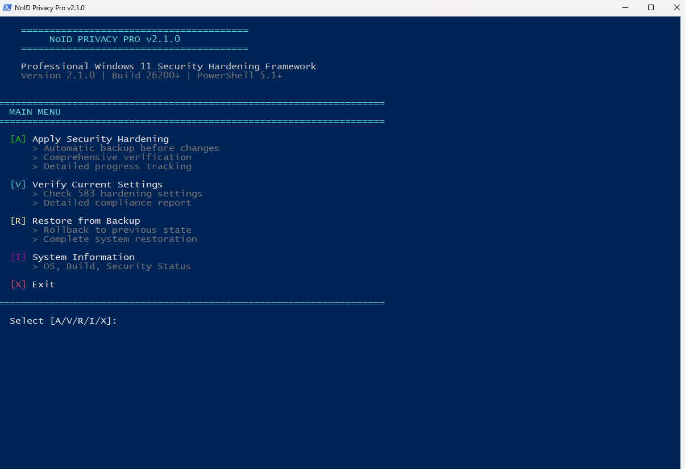

# 🛡️ NoID Privacy - Professional Windows 11 Security & Privacy Hardening Framework

> **⚠️ DISCLAIMER: USE AT YOUR OWN RISK.**  
> This tool makes deep modifications to the Windows Registry and System Services. While extensive backups are created, the authors accept **no responsibility for any damage, data loss, or system instability**. Always review changes before applying.

<div align="center">

[](https://github.com/PowerShell/PowerShell)
[](https://www.microsoft.com/windows/)
[](LICENSE)
[](CHANGELOG.md)
[]()

---

### 🔒 Complete Windows 11 Security Framework
**630+ Settings • 7 Modules • Full Backup & Restore**

[📥 Quick Start](#-quick-start) • [📚 Documentation](#documentation) • [🎯 Key Features](#-key-features) • [💬 Community](https://github.com/NexusOne23/noid-privacy/discussions)

---



**7 Independent Security Modules • Modular Design • Complete BAVR Pattern**

</div>

---

## ⚠️ CRITICAL: Domain-Joined Systems & System Backup

> **⚡ READ THIS BEFORE RUNNING** This tool modifies critical Windows security settings!

### 🏢 Domain-Joined Systems (Active Directory)

**WARNING:** This tool is **NOT recommended for production domain-joined systems** without AD team coordination!

**Why?**
- This tool modifies **local Group Policies**
- Domain Group Policies **override local policies every 90 minutes**
- Your hardening **may be reset automatically** by domain GPOs
- Can lead to configuration conflicts and "flapping" behavior

**RECOMMENDED USE CASES:**
- Standalone systems (Home/Workgroup)
- Home/Personal PCs (not domain-joined)
- Virtual machines (testing/lab environments)
- Air-gapped systems
- Test/development domain-joined systems (non-production)

**For Enterprise/Domain Environments:** 
- **Integrate these settings into your Domain Group Policies instead!** 
- Coordinate with your Active Directory team before using this tool

---

### 💾 System Backup REQUIRED

**Before running this tool, you MUST create:**

1. **Windows System Restore Point** (recommended)
2. **Full System Image/Backup** (critical!)
3. **VM Snapshot** (if running in virtual machine)

**Why?**
- This tool creates **internal backups** for rollback (Registry, Services, Tasks)
- However, a **full system backup** protects against:
 - Unforeseen system issues
 - Hardware failures during hardening
 - Configuration conflicts
 - Critical errors

**Backup Tools:**
- Windows Backup (Settings → System → Storage → Backup)
- System Image (wbadmin, Macrium Reflect, Acronis)
- Hyper-V/VMware: Checkpoint/Snapshot

**⚠️ IMPORTANT: Create your backup BEFORE running the tool. The tool does NOT verify backup existence.**

---

## ⚡ In 30 Seconds

**What?** Microsoft Security Baseline + Advanced Hardening for Windows 11 25H2 
**How?** PowerShell: **Backup** **Apply** **Verify** **Restore** (100% reversible!) 
**For whom?** Professionals, power users, SMBs **without Intune/Active Directory**

**630+ Security Settings • 7 Modules • 100% BAVR Coverage* • Production-Ready**

*_For all settings changed by NoID Privacy_

---

## 🤔 Why "NoID Privacy" when it's mostly Security?

**Because security and privacy are inseparable. You can't have one without the other.**

**🛡️ Security Foundation**
- 425 settings: MS Security Baseline for Win11 25H2
- 24 settings: MS Security Baseline for Edge
- 19 rules: Attack Surface Reduction
- VBS + Credential Guard: Hardware-level protection

**🔒 Privacy Layer**
- DNS: Block telemetry, tracking, ads (DoH)
- Telemetry: 3 modes (MSRecommended/Strict/Paranoid)
- AntiAI: 13 features disabled (Recall, Copilot, Paint AI, Notepad AI, Edge AI)
- Bloatware: 24 pre-installed apps removed

**🎯 The Result:** A hardened system that's both secure against attacks and private from surveillance.

---

## 🌟 Why NoID Privacy?

<div align="center">

| **SECURITY** | **PRIVACY** | **RELIABILITY** | **SAFETY** |
|:---:|:---:|:---:|:---:|
| **Microsoft Baseline 25H2** | **AI Lockdown** | **Professional Quality** | **100% Reversible** |
| 630+ Security Settings | No Recall / Copilot / AI | 100% Verification Coverage | BAVR Architecture |
| 19 ASR Rules (Block Mode) | Telemetry & Ads Blocked | Detailed Logging | Exact Pre-State Restore |
| Zero-Day CVE-2025-9491 | DNS-over-HTTPS (DoH) | Modular Design | Designed for Zero Data Loss |
| VBS & Credential Guard | Edge Browser Hardened | Open Source / Auditable | Safe for Production |

👉 [3-Minute Quick Start](#-quick-start) • 📖 [Full Feature List](Docs/FEATURES.md)

</div>

---

## 🚀 What Makes This Different?

**Full BAVR pattern (Backup → Apply → Verify → Restore) • Zero external binaries • 100% native PowerShell**

| Feature | **NoID Privacy** | HardeningKitty | ChrisTitus winutil | O&O ShutUp10++ |
|:---|:---:|:---:|:---:|:---:|
| **Focus** | **MS Baseline 25H2 + ASR + DNS + Privacy (630+ settings)** | CIS/MS baseline audit & CSV-based hardening | System tweaks, debloat & app installs | Privacy toggles & telemetry control |
| **BAVR Pattern** | **Backup → Apply → Verify → Restore (all modules)** | Audit + HailMary apply + partial restore | System Restore point (no verify) | System Restore + profile export |
| **Verification** | **630+ automated compliance checks** | Audit mode with severity scoring | No compliance scan | No compliance scan |
| **Dependencies** | **Zero (runs on stock PS 5.1/7+)** | PowerShell only | winget/chocolatey required | Portable EXE (closed-source) |
| **AI Lockdown** | **32 policies (Copilot+/Recall/25H2)** | No dedicated AI profile | Individual AI tweaks | Multiple AI/Copilot toggles |

🔄 **BAVR** = Backup-Apply-Verify-Restore (Every change is reversible) 
✈️ **Air-Gapped Ready** — No LGPO.exe, no DLLs, no external downloads

---

## 🔒 Our Privacy Promise

**"We practice what we preach"**

| | |
|---|---|
| 🍪 **Zero Cookies** | No cookie banners, no tracking cookies, no consent popups |
| 📊 **Zero Analytics** | No Google Analytics, no third-party tracking scripts |
| 🔍 **Zero Telemetry** | No usage tracking, no telemetry – only minimal license validation |
| ✅ **100% Verifiable** | Open source - inspect the code yourself |

**Actions speak louder than privacy policies.** Unlike other "privacy" tools that track you, we actually respect your privacy.

---

## 🎯 Key Features

### 🔐 Security Baseline (425 Settings)

**Microsoft Security Baseline 25H2 - 100% Implementation**
- **335 Registry Policies** Computer + User Configuration
- **67 Security Template Settings** Password Policy, Account Lockout, User Rights, Security Options
- **23 Advanced Audit Policies** Complete security event logging
- **Credential Guard** Passwords can't be stolen from memory
- **BitLocker Policies** USB drive protection, enhanced PIN, DMA attack prevention
- **VBS & HVCI** Virtualization-based security

### 🛡️ Attack Surface Reduction (19 Rules)

**19 ASR Rules (17 Block + 2 Configurable)**
- Helps block common ransomware, macro, exploit, and credential theft techniques
- Office/Adobe/Email protection
- Script & executable blocking
- PSExec/WMI: Audit mode (if management tools used), Block otherwise
- New/Unknown Software: Audit mode (if installing untrusted software), Block otherwise

### 🌐 Secure DNS (3 Providers)

**DNS-over-HTTPS with Secure Default (REQUIRE)**
- **Quad9** (Default) Security-focused, malware blocking, 9.9.9.9
- **Cloudflare** Fastest resolver, 1.1.1.1
- **AdGuard** Ad/tracker blocking built-in
- REQUIRE mode (default): no unencrypted fallback
- ALLOW mode (optional): fallback allowed for VPN/mobile/enterprise networks
- IPv4 + IPv6 dual-stack support

### 🔒 Privacy Hardening (77 Settings)

**3 Operating Modes**
- **MSRecommended** (Default) MS-supported, max compatibility
- **Strict** Maximum privacy (AllowTelemetry=0 Enterprise/Education only, Force Deny breaks UCC apps)
- **Paranoid** Hardcore (not recommended)

**Features:**
- Telemetry minimized to Security-Essential level
- Bloatware removal (policy-based on 25H2+ Ent/Edu)
- OneDrive telemetry off (sync functional)
- App permissions default-deny

### 🤖 AI Lockdown (32 Policies)

**13 AI Features Disabled (incl. Master Switch)**
- **Master Switch** Disables generative AI models system-wide
- **Windows Recall** Complete deactivation (component removal + protection)
- **Windows Copilot** System-wide disabled + hardware key remapped
- **Click to Do** Screenshot AI analysis disabled
- **Paint AI** Cocreator, Generative Fill, Image Creator all blocked
- **Notepad AI** GPT features disabled
- **Settings Agent** AI-powered settings search disabled

### 🌐 Edge Hardening (24 Policies)

**Microsoft Edge Security Baseline**
- SmartScreen enforced
- Tracking Prevention strict
- SSL/TLS hardening
- Extension security
- IE Mode restrictions

### 🔧 Advanced Security (50 Settings)

**Beyond Microsoft Baseline**
- **SRP .lnk Protection** — CVE-2025-9491 zero-day mitigation
- **RDP Hardening** — Disabled by default, TLS + NLA enforced
- **Wireless Display Security** — Miracast hardening, screen interception protection
- **Legacy Protocol Blocking** — SMBv1, NetBIOS, LLMNR, WPAD, PowerShell v2
- **TLS Hardening** — 1.0/1.1 OFF, 1.2/1.3 ON
- **UPnP/SSDP Blocking** — Port forwarding attack prevention
- **Discovery Protocols** — Optional WS-Discovery + mDNS disable (Maximum profile)
- **Windows Update** — Interactive configuration
- **Finger Protocol** — Blocked (ClickFix malware protection)

---

## 🔄 BAVR Pattern - Our Unique Approach

**Every change is tracked, verified, and 100% reversible!**

```
[1/4] BACKUP Full system state backup before changes
[2/4] APPLY Settings applied with comprehensive logging
[3/4] VERIFY Automated compliance checks confirm success
[4/4] RESTORE One command reverts everything
```

**What sets us apart:**
- **100% BAVR Coverage*** All settings we change are verified and restorable
- **Professional Code Quality** Advanced functions, comprehensive error handling
- **Complete Restore** Registry, Services, Tasks, Files - everything
- **Production-Ready** Tested on Windows 11 25H2, PowerShell 5.1+

**Before v2.2.0:** 89.4% verification coverage (62 settings missing) 
**After v2.2.0:** 100% verification coverage (all 630+ settings verified) 

---

## ⚠️ What This Does NOT Protect Against

**Important Limitations:**

| Threat | Why Not Protected |
|--------|-------------------|
| **Social Engineering** | If users deliberately bypass all warnings and run malicious files |
| **Supply-Chain Attacks** | Malware embedded in legitimate signed software |
| **Physical Access** | Stolen device without BitLocker (use BitLocker!) |
| **Nation-State Actors** | Sophisticated targeted attacks require enterprise EDR/XDR |
| **Zero-Day Exploits** | Unknown vulnerabilities not yet patched by Microsoft |

**What you need additionally:**
- **Regular Windows Updates** — Critical for security patches
- **BitLocker** — For lost/stolen device protection
- **User Awareness** — Don't click suspicious links/attachments
- **Backups** — 3-2-1 backup strategy for ransomware resilience

> **NoID Privacy hardens your system significantly, but no security solution provides 100% protection.** 
> Defense in depth is always recommended.

---

## 📥 Quick Start

### ⚡ One-Liner Install (Recommended)

**Step 1:** Open PowerShell as Administrator
- Press `Win + X` → Click **"Terminal (Admin)"**

**Step 2:** Run installer

```powershell
# Download and run (Windows 11 25H2 recommended)
irm https://raw.githubusercontent.com/NexusOne23/noid-privacy/main/install.ps1 | iex
```

**What it does:**
1. Checks Administrator privileges
2. Verifies Windows 11 25H2
3. Downloads latest release from GitHub
4. Extracts & unblocks all files
5. Starts interactive mode

**Alternative - Manual Install:**

```powershell
# 1. Clone repository
git clone https://github.com/NexusOne23/noid-privacy.git
cd noid-privacy

# 2. Run as Admin
.\Start-NoIDPrivacy.bat

# 3. Verify after reboot
.\Tools\Verify-Complete-Hardening.ps1
```

> **Downloaded ZIP?** Run `Start-NoIDPrivacy.bat` - it automatically unblocks all files!

---

## 💻 Usage Examples

### Interactive Mode (Recommended)

```powershell
# Start interactive menu
.\Start-NoIDPrivacy.bat

# Follow prompts:
# 1. Select modules (all or custom)
# 2. Choose settings (DNS provider, Privacy mode, etc.)
# 3. Automatic backup → apply → verify
# 4. Reboot prompt
```

### Direct Execution

```powershell
# Apply all modules
.\NoIDPrivacy.ps1 -Module All

# Apply specific module
.\NoIDPrivacy.ps1 -Module Privacy

# Dry-run (no changes)
.\NoIDPrivacy.ps1 -Module All -DryRun
```

### Verification

```powershell
# Full verification (632 checks with Paranoid mode)
.\Tools\Verify-Complete-Hardening.ps1

# Expected output (all modules enabled, Paranoid mode):
# SecurityBaseline: 425/425 verified
# ASR: 19/19 verified
# DNS: 5/5 verified
# Privacy: 77/77 verified
# AntiAI: 32/32 verified
# EdgeHardening: 24/24 verified
# AdvancedSecurity: 50/50 verified
# Total: 632/632 (100%)
```

### Restore

```powershell
# Restore from latest backup
.\Core\Rollback.ps1 -RestoreLatest

# Or via interactive menu
.\Start-NoIDPrivacy.bat
# Select "Restore from backup"
```

---

## 📊 Module Overview

| Module | Settings | Description | Status |
|--------|----------|-------------|--------|
| **SecurityBaseline** | 425 | Microsoft Security Baseline 25H2 | v2.2.0 |
| **ASR** | 19 | Attack Surface Reduction Rules | v2.2.0 |
| **DNS** | 5 | Secure DNS with DoH encryption | v2.2.0 |
| **Privacy** | 77 | Telemetry, Bloatware, OneDrive hardening (Strict) | v2.2.0 |
| **AntiAI** | 32 | AI lockdown (13 features, 32 compliance checks) | v2.2.0 |
| **EdgeHardening** | 24 | Microsoft Edge security (24 policies) | v2.2.0 |
| **AdvancedSecurity** | 50 | Beyond MS Baseline (SRP, Legacy protocols, Wireless Display, Discovery Protocols, IPv6) | v2.2.0 |
| **TOTAL** | **632** | **Complete Framework (Paranoid mode)** | **Production** |

**Release Highlights:**

- **v2.2.0:** 100% verification coverage (all 630+ settings verified)
- **v2.2.0:** Improved Advanced Security module with SRP .lnk protection
- **v2.2.0:** Enhanced RDP hardening with TLS + NLA enforced
- **v2.2.0:** Legacy protocol blocking (SMBv1, NetBIOS, LLMNR, WPAD, PowerShell v2)
- **v2.2.0:** TLS hardening (1.0/1.1 OFF, 1.2/1.3 ON)
- **v2.2.0:** Windows Update interactive configuration
- **v2.2.0:** Finger Protocol blocked (ClickFix malware protection)
- **v2.2.0:** Enhanced Registry Backup (Smart JSON-Fallback for protected system keys)

📖 [Detailed Module Documentation](Docs/FEATURES.md)

---

## ✅ Perfect For

### **Ideal Use Cases**

**Small/Medium Business (SMB)**
- No Active Directory/Intune licenses
- Cloud-first (Microsoft 365, Google Workspace)
- Remote/hybrid work security
- Compliance without enterprise infrastructure

**Freelancers & Consultants**
- Client data protection
- Secure workstations without domain
- Professional security standards
- Safe experimentation (complete backup)

**Power Users & Privacy-Conscious**
- Real security, not just "debloat"
- AI/Telemetry lockdown
- Understand every setting
- Full control + reversibility

**IT Pros Without Intune**
- Standalone Windows 11 hardening
- Microsoft Baseline compliance locally
- Quick deploy for clients
- No domain controller required

### **Not Ideal For**

**Enterprise with Intune/AD**
- Use [Microsoft Security Baselines](https://learn.microsoft.com/en-us/windows/security/operating-system-security/device-management/windows-security-configuration-framework/security-compliance-toolkit-10) with Group Policy instead

**Windows 10 or Older**
- This tool is designed for Windows 11 (24H2/25H2 recommended, 23H2 compatible)

**Legacy Software Dependencies**
- If you rely on unsafe SMB1/RPC/DCOM

**Strict MDM Reporting**
- If compliance must be centrally reported

---

## ⚙️ Requirements & Compatibility

### Hardware & OS

NoID Privacy is designed for modern, officially supported Windows 11 systems.

If your PC can run Windows 11 according to Microsoft's **official requirements**, it is compatible with NoID Privacy:

- **OS:** Windows 11 24H2/25H2 recommended (23H2 compatible)
- **CPU:** Any CPU on Microsoft's Windows 11 support list (Intel 8th Gen / AMD Ryzen 2000+)
- **Firmware:** UEFI with **Secure Boot** enabled
- **TPM:** 2.0 (required for BitLocker, Credential Guard, VBS)
- **RAM:** 8 GB minimum, 16 GB recommended for VBS
- **Admin Rights:** Required

> **Short version:** If Windows 11 is officially supported on your PC, NoID Privacy is supported too.

**Tested & Compatible:**

| OS Version | Status |
|------------|--------|
| Windows 11 25H2 (Build 26200+) | **Fully Tested** |
| Windows 11 24H2 (Build 26100+) | Compatible |
| Windows 11 23H2 (Build 22631+) | Some features N/A |

### Legacy Devices & Protocols

The **AdvancedSecurity** and **SecurityBaseline** modules intentionally disable legacy and insecure protocols:

- **TLS 1.0/1.1** (TLS 1.2+ required)
- **NetBIOS** name resolution, **LLMNR**, **WPAD**
- **PowerShell v2**
- **Administrative shares** (C$, ADMIN$) in some scenarios
- **NTLMv1/LM** authentication (NTLMv2 only)

This can affect **very old hardware and software**, for example:

- NAS, printers, IP cameras, and IoT devices that only support TLS 1.0/1.1
- Legacy Windows systems (XP, 7) and old Samba implementations
- Old management tools that rely on hidden admin shares

**In practice:** Environments using hardware and software from **~2018 onwards** are fully compatible.

If you still depend on legacy devices, use the built-in **BAVR** pattern (Backup → Apply → Verify → Restore) to roll back if something breaks.

### 🛡️ Antivirus Compatibility

#### Designed for Microsoft Defender – Works with Any Antivirus

**NoID Privacy is optimized for the default Windows 11 security stack:**

```
Windows 11 + Microsoft Defender + NoID Privacy = 100% Feature Coverage (630+ Settings)
```

This is the **recommended setup** – just install Windows 11, keep Defender active, and run NoID Privacy. You get:
- ✅ **All 7 modules** (Security Baseline, ASR, DNS, Privacy, AntiAI, Edge, Advanced Security)
- ✅ **19 ASR rules** protecting against ransomware, exploits, and malware
- ✅ **Full enterprise-grade hardening** with zero additional software

---

#### Already Using Third-Party Antivirus?

**No problem!** NoID Privacy automatically detects third-party antivirus software and adapts:

| Your Setup | What Happens | Coverage |
|------------|--------------|----------|
| **Defender Active** | All modules applied | **632 settings** (100%) |
| **3rd-Party AV** (Kaspersky, Norton, Bitdefender, etc.) | ASR skipped, all other modules applied | **613 settings** (~97%) |

**Why?** ASR (Attack Surface Reduction) rules are a **Microsoft Defender exclusive feature**. Third-party antivirus products provide their own equivalent protection. NoID Privacy detects this and gracefully skips ASR while applying everything else.

When a third-party antivirus is detected, you'll see a clear notification:

```
========================================
  ASR Module Skipped
========================================

Third-party antivirus detected: Kaspersky Total Security

ASR rules require Windows Defender to be active.
Your antivirus (Kaspersky Total Security) has its own protection features.

This is NOT an error - ASR will be skipped.
```

**Why?** Third-party antivirus products typically provide their own equivalent protection features. The rest of the hardening (Security Baseline, DNS, Privacy, Edge, Advanced Security) will still be applied.

**All other modules work normally** regardless of your antivirus choice.

---

## 🔒 Security & Quality

### Code Quality

- **PSScriptAnalyzer:** Available for static analysis
- **Pester Tests:** Unit and integration tests in `Tests/` directory (`.\Tests\Run-Tests.ps1`)
- **Verification:** 630+ automated compliance checks in production
- **Production-Ready:** Professional error handling and comprehensive logging
- **Best Practices:** Advanced Functions, CmdletBinding, Validated Parameters

### What This Tool Does

- Hardens Windows 11 to enterprise standards
- Implements Microsoft Security Baseline 25H2
- Protects against zero-day exploits (CVE-2025-9491)
- Minimizes telemetry to Security-Essential level
- Locks down AI features (Recall, Copilot, etc.)
- Configures BitLocker policies, Credential Guard, VBS 

### What This Tool Does NOT Do

- Install third-party antivirus (uses Windows Defender)
- Configure domain-specific policies
- Modify BIOS/UEFI settings
- Break critical Windows functionality
- Prevent re-enabling features 

### Reversibility

- **What CAN be restored:** Services, Registry, Firewall, DNS, Tasks, AI features
- **What CAN be auto-restored:** Most removed bloatware apps via `winget` during session restore (where mappings exist)
- **What may still need manual reinstall:** Unmapped/third-party bloatware apps (use Microsoft Store)
- **Backup System:** Complete system state before applying
- **REMOVED_APPS_LIST.txt:** Created during bloatware removal with a full list of removed apps for manual reinstall if needed
- **Documented Changes:** All changes logged

---

## ⚙️ Configuration

### Default Settings

All settings configured for **maximum security with maintained usability**:
- Services: Telemetry services controlled, critical services protected
- Firewall: Inbound blocked, outbound allowed
- Privacy: Default-deny for app permissions (user can enable individually)
- BitLocker: Policies set, user must enable manually
- AI Features: Disabled via Registry (100% reversible)

### Customization

All module settings can be customized via JSON files in `Modules/*/Config/`:

```powershell
# Example: Adjust DNS provider
Edit: Modules/DNS/Config/Providers.json

# Example: Modify Privacy mode
Edit: Modules/Privacy/Config/Privacy-MSRecommended.json

# Example: Configure ASR exceptions
Edit: Modules/ASR/Config/ASR-Rules.json
```

---

## 🔧 Troubleshooting

> **Can't install software after hardening?** See [Temporarily Disable ASR Rule](#temporarily-disable-asr-rule-for-software-installation) for step-by-step solution

### Common Issues

**"Access Denied" errors**
- Not running as Administrator
- Right-click PowerShell → "Run as Administrator"

**VBS/Credential Guard not active after reboot**
- Hardware incompatibility (no TPM 2.0 or virtualization disabled)
- Enable virtualization in BIOS/UEFI
- Verify: `.\Tools\Verify-Complete-Hardening.ps1`

**BitLocker not activating**
- No TPM 2.0 or insufficient disk space
- Check TPM: `Get-Tpm`
- Manual activation: Control Panel → BitLocker

**ASR blocking legitimate software installation**
- ASR rule "Block executable files unless they meet prevalence" blocks unknown installers
- See [Temporarily Disable ASR Rule](#temporarily-disable-asr-rule-for-software-installation) below

---

### Temporarily Disable ASR Rule for Software Installation

**Problem:** ASR blocks installation of legitimate software (e.g., downloaded installers not in Microsoft's reputation database)

**Blocked Rule:** `01443614-cd74-433a-b99e-2ecdc07bfc25` ("Block executable files unless they meet prevalence, age, or trusted list")

**Solution:** Temporarily set the rule to AUDIT mode (warns only, doesn't block)

**Step 1: Disable Tamper Protection** (GUI method - easiest)
1. Press `Win` key → Type "Windows Security" → Enter
2. Go to: **Virus & threat protection**
3. Click: **Manage settings**
4. Scroll down to: **Tamper Protection** Toggle **OFF**

**Step 2: Set ASR Rule to AUDIT** (PowerShell as Admin)

```powershell
# Get current ASR configuration
$currentIds = (Get-MpPreference).AttackSurfaceReductionRules_Ids
$currentActions = (Get-MpPreference).AttackSurfaceReductionRules_Actions

# Convert to arrays
$ids = @($currentIds)
$actions = @($currentActions)

# Find the prevalence rule
$targetGuid = "01443614-cd74-433a-b99e-2ecdc07bfc25"
$index = [array]::IndexOf($ids, $targetGuid)

# Set to AUDIT (2 = Audit, 1 = Block)
$actions[$index] = 2

# Apply changes
Set-MpPreference -AttackSurfaceReductionRules_Ids $ids -AttackSurfaceReductionRules_Actions $actions

Write-Host " ASR Prevalence Rule: AUDIT (Installation now possible)" -ForegroundColor Green
```

**Step 3: Install your software**

**Step 4: Re-enable the ASR Rule** (PowerShell as Admin)

```powershell
# Get current ASR configuration
$currentIds = (Get-MpPreference).AttackSurfaceReductionRules_Ids
$currentActions = (Get-MpPreference).AttackSurfaceReductionRules_Actions

# Convert to arrays
$ids = @($currentIds)
$actions = @($currentActions)

# Find the prevalence rule
$targetGuid = "01443614-cd74-433a-b99e-2ecdc07bfc25"
$index = [array]::IndexOf($ids, $targetGuid)

# Set back to BLOCK
$actions[$index] = 1

# Apply changes
Set-MpPreference -AttackSurfaceReductionRules_Ids $ids -AttackSurfaceReductionRules_Actions $actions

Write-Host " ASR Prevalence Rule: BLOCK (Protection restored)" -ForegroundColor Green
```

**Step 5: Re-enable Tamper Protection** (Windows Security Toggle ON)

**IMPORTANT:** Always re-enable both the ASR rule AND Tamper Protection after installation!

---

### Windows Insider Program Compatibility

**Problem:** After applying Privacy hardening (MSRecommended mode), Windows Insider enrollment requires extra steps.

**Cause:** Privacy module sets `AllowTelemetry=1` (Required diagnostic data) via Group Policy, which prevents the user from enabling "Optional diagnostic data" in Settings - a requirement for Insider Program enrollment.

**Solution:**

**Step 1: Temporarily remove the telemetry policy** (PowerShell as Admin)

```powershell
Remove-ItemProperty -Path "HKLM:\SOFTWARE\Policies\Microsoft\Windows\DataCollection" -Name "AllowTelemetry"
```

**Step 2: Reboot** (recommended for policy changes to take effect)

```powershell
Restart-Computer
```

**Step 3: Join Windows Insider Program**
1. Go to: Settings > Windows Update > Windows Insider Program
2. Click: **Get Started**
3. When prompted, enable "Optional diagnostic data"
4. Complete Insider enrollment and select your channel (Dev/Beta/Release Preview)

**Step 4 (Optional): Re-apply Privacy hardening**

```powershell
.\NoIDPrivacy.ps1 -Module Privacy
```

**Note:** Once enrolled in the Insider Program, Windows will continue to receive preview builds even after re-applying Privacy hardening with `AllowTelemetry=1`.

---

### Logs

All operations logged to:
```
Logs/NoIDPrivacy_YYYYMMDD_HHMMSS.log
```

**Example:** `NoIDPrivacy_20251117_142345.log`

---

## 📚 Documentation

### Core Documentation
- **[Features](Docs/FEATURES.md)** - Complete 630+ setting reference
- **[Changelog](CHANGELOG.md)** - Version history
- **[Quick Start](#-quick-start)** - Installation guide (see above)
- **[Troubleshooting](#troubleshooting)** - Common issues (see above)

### 💬 Community

- **[💬 Discussions](https://github.com/NexusOne23/noid-privacy/discussions)** - Questions and ideas
- **[🐛 Issues](https://github.com/NexusOne23/noid-privacy/issues)** - Bug reports only
- **[📚 Documentation](Docs/FEATURES.md)** - Complete feature reference

---

## 🙏 Acknowledgments

- **Microsoft Security Baseline Team** for Windows 11 25H2 guidance
- **PowerShell Community** for best practices and patterns
- **Open Source Contributors** for testing and feedback

---

## 📜 License

### Dual-License Model

NoID Privacy is available under a **dual-licensing** model:

#### 🆓 Open Source License (GPL v3.0)

**For individuals, researchers, and open-source projects:**

This project is licensed under the **GNU General Public License v3.0** (GPL-3.0). 

✅ **You CAN:**
- ✔️ Use the software freely for personal and commercial purposes
- ✔️ Modify the source code
- ✔️ Distribute the software
- ✔️ Distribute your modifications

⚠️ **You MUST:**
- 📝 Disclose your source code when distributing
- 🔓 License your modifications under GPL v3.0
- 📄 Include the original copyright notice
- 📋 State significant changes made to the software

[Read the full GPL v3.0 License](LICENSE)

#### 💼 Commercial License

**For companies and organizations that want to:**
- Integrate this software into closed-source/proprietary products
- Distribute this software without disclosing source code
- Receive dedicated commercial support and warranties
- Avoid GPL v3.0 copyleft requirements

**Contact:**
- **Email:** [support@noid-privacy.com](mailto:support@noid-privacy.com) (Preferred for commercial inquiries)
- **GitHub:** [💬 Discussions](https://github.com/NexusOne23/noid-privacy/discussions) (Public questions)

---

### Third-Party Components

This software implements security configurations based on:
- **Microsoft Security Baselines** - Public documentation
- **Microsoft Defender ASR Rules** - Official documentation  
- **DNS Providers** - Cloudflare, Quad9, AdGuard (public services)

Microsoft, Windows, and Edge are trademarks of Microsoft Corporation. This project is not affiliated with Microsoft.

---

## ⚠️ Disclaimer

This script modifies critical system settings. Use at your own risk. Always:
1. **Create a system backup** before running
2. **Test in a VM** first
3. **Review the code** to understand changes
4. **Verify compatibility** with your environment

The authors are not responsible for any damage or data loss.

---

## 📈 Project Status

**Current Version:** 2.2.0 
**Last Updated:** December 8, 2025 
**Status:** Production-Ready

### Release Highlights v2.2.0

- 630+ settings (expanded from 580+)
- NonInteractive mode for GUI integration
- Third-party AV detection and graceful ASR skip
- AntiAI enhanced to 32 policies (was 24)
- Pre-Framework ASR snapshot
- Smart Registry Backup with JSON fallback

📋 [See Full Changelog](CHANGELOG.md)

---

<div align="center">

**Made with 🛡️ for the Windows Security Community**

[Report Bug](https://github.com/NexusOne23/noid-privacy/issues) [Request Feature](https://github.com/NexusOne23/noid-privacy/issues) [Discussions](https://github.com/NexusOne23/noid-privacy/discussions)

 **Star this repo** if you find it useful!

</div>


