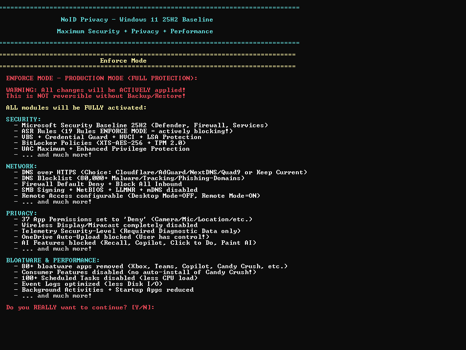

# 🛡️ NoID Privacy – Windows 11 Security & Privacy Hardening Toolkit for Everyone

> **Enterprise-Grade Security & Privacy Hardening Tool for Windows 11 25H2 – No Intune, No AD, Complete Backup Included**

[](https://github.com/PowerShell/PowerShell)
[](https://www.microsoft.com/windows/)
[](LICENSE)
[](CHANGELOG.md)

---

## 🎯 In 30 Seconds

📌 **What?** → Microsoft Security Baseline 25H2 + CISA KEV Protection, locally on Windows 11  
📌 **How?** → PowerShell: **Apply** → **Verify** → **Restore** (fully reversible!)  
📌 **For whom?** → SMB, freelancers, power users **without Intune/Active Directory**

**392 Registry Keys · 19 ASR Rules · 124 Verification Checks · Complete Backup/Restore**

---

### 🎯 At a Glance

<div align="center">

| 🛡️ **SECURITY** | 🔒 **PRIVACY** | ⚡ **PERFORMANCE** | 🔄 **REVERSIBLE** |
|:---:|:---:|:---:|:---:|
| **100% locally-implementable<br>MS Baseline (213/365)** | **95% Telemetry Reduced** | **30 Tasks Disabled** | **Complete Backup** |
| 19 ASR Rules (Enforce) | 9 AI Features Locked | Event Logs Optimized | 494 Settings Restored |
| 13 Exploit Mitigations | 37 App Permissions | No Bloatware | **0 Errors** |
| Credential Guard + VBS | 79,776 Domains Blocked | Faster Boot | Safe to Experiment |

**→ [3-Minute Setup](#-quick-start)** · **[See All 400+ Settings](FEATURES.md)** · **[Compare with Others](#-why-noid-privacy)**

</div>

---


*Screenshot: Interactive 'Enforce' run on Windows 11 25H2 – 400+ settings hardened in ~3 minutes*

> 🇩🇪 **Deutsche Nutzer:** Runtime-Switch EN/DE – alle Menüs und UI-Texte auf Deutsch verfügbar (kein Extra-Download nötig)

---

## 🚀 Quick Start

### One-Liner Install (Recommended - No Git Required!)

**Step 1:** Open PowerShell as Administrator
- Press `Win + X` → Click **"Terminal (Admin)"** or **"PowerShell (Admin)"**

**Step 2:** Paste this single line and press ENTER:
```powershell
irm https://raw.githubusercontent.com/NexusOne23/noid-privacy/main/install.ps1 | iex
```

> ⚠️ **Important:** This only works in **PowerShell** (not CMD)!

**What it does:**
1. **[1/5] Checks Administrator privileges** - Exits with clear message if not admin
2. **[2/5] Checks Windows 11** - Verifies Build 22000+ (25H2 recommended)
3. **[3/5] Downloads latest release** - Fetches from GitHub API automatically
4. **[4/5] Extracts & Unblocks** - Removes Zone.Identifier from all PowerShell files
5. **[5/5] Starts interactive mode** - No manual steps needed!

**Benefits:**
- ✅ No Git installation required
- ✅ No manual unblocking needed
- ✅ Always latest release
- ✅ Instant start

### Manual Install (Git Required)
```powershell
# 1. Download
git clone https://github.com/NexusOne23/noid-privacy.git
cd noid-privacy

# 2. Run as Admin
.\Apply-Win11-25H2-SecurityBaseline.ps1 -Interactive

# 3. Verify
.\Verify-SecurityBaseline.ps1
```

> **⚠️ Downloaded ZIP instead of Git Clone?**  
> Windows marks downloaded files as "blocked" (Zone.Identifier).  
> **Solution:** Run `Start-NoID-Privacy.bat` - it automatically unblocks all files!  
> **Manual:** Right-click each file → Properties → Check "Unblock" → OK  
> **Details:** [FAQ - Troubleshooting](FAQ.md#-troubleshooting)

**→ [Detailed Installation Guide](QUICKSTART.md)** · **[See All Features](FEATURES.md)** · **[View Changelog](CHANGELOG.md)**

---

## 🌟 Key Features

### 🛡️ Security Hardening - Enterprise Protection at Home

**Your Computer Becomes a Fortress:**
- **Microsoft Defender** → 11 protection layers = Real-time, Cloud, Behavior, Network, PUA, Archive, USB, Email, Script scanning + Tamper Protection
- **19 Attack Surface Reduction Rules** → Blocks ransomware, macros, exploits, credential theft - [See ASR Details](ASR_RULES.md)
- **13 Exploit Mitigations** → Memory-based attacks fail (DEP, SEHOP, ASLR, CFG, Heap Protection, Image Load Protection, Bottom-Up ASLR, High Entropy, etc.)
- **Credential Protection** → Your passwords can't be stolen from memory (Credential Guard + LSA Protection + Mimikatz mitigation)
- **BitLocker XTS-AES-256** → Stolen laptop = useless encrypted brick (TPM 2.0 + optional PIN)
- **Strict Firewall** → Nothing gets in without your permission (block all incoming + 13 legacy protocol blocks)
- **Modern Network Only** → TLS 1.2/1.3, SMB encryption, no legacy protocols (LLMNR/NetBIOS/WPAD/mDNS disabled)

**Bottom line:** You get Fortune-500-style hardening on a standalone device

### 🔒 Privacy Protection - Minimized Telemetry

**Your Privacy is Maximized:**
- **Telemetry Minimized** → 25+ services + 30 tasks + 392 registry keys configured for minimum data collection
- **AI Lockdown (9 features)** → Windows Recall DISABLED (no screenshots of passwords!), Copilot blocked (4 layers), Click to Do, Paint AI (3), Notepad AI, Settings Agent, Copilot Proactive
- **App Permission Control** → 37 categories default-DENY (apps can't spy without explicit permission)
- **Clean System** → 80+ bloatware app patterns checked (Xbox, 3D apps, Candy Crush, Teams Chat, Copilot, Widgets)
- **79,776 Trackers Blocked** → DNS-level blocking via Steven Black hosts + Cloudflare DoH

**Bottom Line:** Telemetry reduced to Security-Essential level (Required Diagnostic Data for Windows Update/Defender)

**ℹ️ Reality Check:** Windows 11 requires minimum telemetry for:
- Windows Update (security patches)
- Microsoft Defender updates (malware signatures)
- Compatibility checks (driver updates)

This project minimizes telemetry via Registry, Services, Firewall, and DNS blocking - but cannot eliminate it entirely without breaking core functionality.

### ⚡ Performance - Faster & Cleaner

**Your PC Breathes Easier:**
- **30 Background Tasks Disabled** → Less CPU/disk usage when idle (Update/Defender tasks stay active!)
- **Event Log Optimization** → Critical logs increased, noise logs reduced = less disk I/O
- **Windows Search Optimized** → Local-only, no web/Bing queries
- **No Bloatware** → Faster boot, more disk space, cleaner Start Menu

**Bottom Line:** Windows feels snappier, boots faster

### 🎯 Advanced Features - Pro-Level Control

**Power User Tools:**
- **Windows LAPS** → Auto-rotating admin passwords (30 days, 20 chars, Entra/AD-Escrow)
- **Advanced Auditing** → Complete security event logging (Object Access, Logon, DS, Policy, PnP, PS-Logging)
- **Smart App Control** → AI-based app reputation (requires clean install - script prepares policies)
- **Enhanced UAC** → Maximum privilege protection (always notify + Enhanced Privilege Protection Mode ready)
- **Edge Privacy** → Tracking prevention Balanced, SmartScreen enforced, DoH automatic, Site Isolation active

**Bottom Line:** Enterprise-level features at home

### 🌐 DNS Security & Privacy

**Multi-Provider DNS-over-HTTPS** → Choose from 4 providers (Cloudflare, AdGuard, NextDNS, Quad9)  
**100% Strict DoH Enforcement** → No fallback to unencrypted DNS (`autoupgrade=yes`, `udpfallback=no`)  
**Steven Black Hosts** → 79,776 malicious/tracking domains blocked (cache-optimized)

<details>
<summary><b>📋 DNS Details (click to expand)</b></summary>

**Choose Your DNS-over-HTTPS Provider:**

| Provider | Best For | Unique Features |
|----------|----------|----------------|
| **Cloudflare** (Default) | Speed + Global Coverage | 1.1.1.1, Fastest, WARP integration |
| **AdGuard** | Privacy + EU Compliance | Built-in ad/tracker blocking, GDPR |
| **NextDNS** | Customization + Analytics | Custom profiles, detailed analytics |
| **Quad9** | Security + Threat Intel | Malware blocking, Non-profit, GDPR |

**All Providers Include:**
- ✅ **100% Strict Enforcement:** No fallback to unencrypted DNS
- ✅ **Dual-Stack:** IPv6 + IPv4 (IPv6 preferred when available)
- ✅ **Per-Adapter:** Only real network adapters (VPN/Virtual excluded)
- ✅ **Global Policy:** `EnableAutoDoh=2` (Windows-wide enforcement)
- ✅ **DNSSEC Validation:** Prevents DNS spoofing/poisoning

**Steven Black Unified Hosts File (Optimized)**
- ✅ **79,776 malicious/tracking domains blocked** at DNS level (before queries even reach DNS!)
- ✅ **Compressed to 8,864 lines** (9 domains per line - Windows DNS Cache optimized)
- ✅ **Zero performance impact** - in-memory lookup
- ✅ **Updated regularly** from Steven Black repository

**Defense in Depth Architecture:**
1. **Hosts file** (79K+) → Blocks before DNS query
2. **DoH Provider** → Encrypts queries (ISP can't see)
3. **DNSSEC** → Validates responses (prevents spoofing)
4. **Threat Intel** (Quad9) or **Ad Blocking** (AdGuard) → Extra protection

**→ [See Full DNS Provider Comparison](FEATURES.md#-network-security)**

</details>

---

## ✅ Why NoID Privacy?

**The only Windows 11 hardening tool with Apply + Verify + Complete Restore – no Intune required.**

| Feature | NoID Privacy | simeononsecurity | W4RH4WK Debloat | ChrisTitus winutil | O&O ShutUp10++ |
|---------|--------------|------------------|-----------------|---------------------|----------------|
| **MS Baseline 25H2** | ✅ 100% of locally-implementable (213/365) | ⚠️ ~70% | ❌ ~20% | ⚠️ ~40% | ⚠️ ~30% |
| **Full Backup/Restore** | ✅ All (Registry, Services, Tasks, Firewall, DNS) | ❌ Registry only | ❌ None | ❌ None | ⚠️ Profiles only |
| **Verification** | ✅ 124 checks | ⚠️ Limited | ❌ None | ❌ None | ❌ None |
| **CISA KEV Coverage** | ✅ 85% (17/20 config-mitigable, not patch-only) | ⚠️ ~50% | ❌ ~10% | ⚠️ ~30% | ❌ Minimal |
| **Privacy/AI Lockdown** | ✅ 9 AI features + 37 app permissions | ✅ Yes | ✅ Yes | ✅ Yes | ✅ Yes |
| **Requires Intune/AD** | ❌ No | ❌ No | ❌ No | ❌ No | ❌ No |

**→ Only tool combining enterprise-grade baseline compliance with complete backup/restore for standalone systems.**

**About CISA KEV Coverage (85%):**  
We count KEV items that can be mitigated through hardening (ASR rules, protocol disablement, driver blocklist, service hardening) – not patch-based CVEs that require Windows Updates. Our 17/20 coverage focuses on configuration-based protections that this tool can actually implement.

**❌ Not for you?**  
This tool targets **Windows 11 25H2 standalone systems**. Not ideal for: Enterprise with Intune/AD (use Group Policy instead), Windows 10/older, legacy software requiring unsafe protocols, strict MDM reporting. → [Full details below](#-perfect-for)

---

## 🎯 Perfect For

### ✅ **Ideal Use Cases**

**Small/Medium Business (SMB)**  
→ No Active Directory/Intune licenses  
→ Cloud-first (Microsoft 365, Google Workspace)  
→ Remote/hybrid work, BYOD security  
→ Compliance requirements without enterprise infrastructure

**Freelancers & Consultants**  
→ Client data protection  
→ Secure workstations without domain  
→ Professional security standards  
→ Safe experimentation (complete backup)

**Power Users & Privacy-Conscious**  
→ Real security, not just "debloat"  
→ AI/Telemetry/Recall lockdown  
→ Understand what each setting does  
→ Full control + reversibility

**Sysadmins Without Intune**  
→ Standalone Windows 11 hardening  
→ Microsoft Baseline compliance locally  
→ Quick deploy for multiple clients  
→ No domain controller required

### ❌ **Not Ideal For**

**Enterprise with Intune/AD**  
→ Use Group Policy/Intune instead (better for large-scale management)

**Windows 10 or Older**  
→ This tool targets Windows 11 25H2 specifically

**Legacy Software Dependencies**  
→ If you rely on unsafe SMB1/RPC/DCOM configurations  
→ Check [Known Issues](KNOWN_ISSUES.md) first

**Strict MDM Reporting**  
→ If compliance must be reported to central MDM (Intune wins)

---

## 📋 Requirements

### System Requirements
- **OS:** Windows 11 25H2 (Build 26100+)
- **TPM:** TPM 2.0 (for BitLocker, Credential Guard, VBS)
- **CPU:** Intel 8th Gen+ or AMD Ryzen 2000+ (for optimal AES-NI support)
- **RAM:** 8 GB minimum (16 GB recommended for VBS)
- **Disk:** 256 GB+ (for BitLocker encryption)

### Software Requirements
- **PowerShell:** 5.1 or higher (Windows built-in)
- **Administrator Rights:** Required for all operations
- **Internet Connection:** NOT required for script execution
  - ✅ Hosts file (80K+ domains) included locally in project
  - ✅ DNS-over-HTTPS is only configured (no download needed)
  - ℹ️ Internet only needed for: git clone (initial download)

---

## 📖 Usage & Examples

### Core Workflow

```powershell
# 1. Apply hardening (Interactive Mode recommended)
.\Apply-Win11-25H2-SecurityBaseline.ps1 -Interactive

# 2. Verify settings (124 checks)
.\Verify-SecurityBaseline.ps1

# 3. Reboot (for VBS, Credential Guard, BitLocker)
shutdown /r /t 0
```

### Backup & Restore

```powershell
# Create backup BEFORE applying
.\Backup-SecurityBaseline.ps1

# Restore if needed
.\Restore-SecurityBaseline.ps1
```

### Modes

```powershell
# Audit Mode (safe testing - no enforcement)
.\Apply-Win11-25H2-SecurityBaseline.ps1 -Mode Audit

# Enforce Mode (full hardening)
.\Apply-Win11-25H2-SecurityBaseline.ps1 -Mode Enforce

# Custom modules (interactive selection)
.\Apply-Win11-25H2-SecurityBaseline.ps1 -Interactive
  → Choose language (EN/DE)
  → Select "Custom Configuration"
  → Pick modules (Core, ASR, Privacy, etc.)
```

**→ Full documentation: [QUICKSTART.md](QUICKSTART.md) · [INSTALLATION.md](INSTALLATION.md) · [FAQ.md](FAQ.md)**

---

## 🔧 Module Architecture

The project uses a modular architecture with **13 specialized modules**: Core, ASR, Advanced, DNS, Bloatware, Telemetry, Performance, AI, Edge, OneDrive, UAC, WindowsUpdate, WirelessDisplay

<details>
<summary><b>📋 Module Details (click to expand)</b></summary>

| Module | Description | Key Features |
|--------|-------------|-------------|
| **Core** | Security baseline, Defender, Firewall, Services | 25 services disabled, 13 firewall rules, 13 exploit mitigations, Admin/Guest account hardening |
| **ASR** | Attack Surface Reduction rules | 19 ASR rules (Enforce mode), Smart App Control |
| **Advanced** | VBS, Credential Guard, LAPS, Auditing | Credential Guard, VBS, HVCI, LSA-PPL, BitLocker policies, Windows LAPS, TLS/SSL hardening |
| **DNS** | Multi-Provider DoH, DNSSEC, Blocklist | 4 providers (Cloudflare/AdGuard/NextDNS/Quad9), 100% strict enforcement, DNSSEC validation, 79,776 blocked domains, Strict Inbound Firewall |
| **Bloatware** | App removal, Consumer features | 80+ app patterns, Teams Chat/Copilot/Widgets disabled, Consumer Features blocked |
| **Telemetry** | Privacy protection, App permissions | 25+ services, 392 registry keys (110 telemetry-specific), 37 app permission categories, Camera/Mic controls |
| **Performance** | Scheduled tasks, Event logs | 30 tasks disabled, Event log optimization, Windows Search local-only, Prefetch/Superfetch tuning |
| **AI** | Recall, Copilot, AI tracking | 9 AI features disabled: Recall, Copilot (4 layers), Click to Do, Paint AI (3), Notepad AI, Settings Agent, Copilot Proactive |
| **Edge** | Microsoft Edge security baseline | SmartScreen enforced, Tracking Prevention, DoH automatic, Site Isolation, Extension policies |
| **OneDrive** | Privacy hardening OR complete removal | Default: Privacy hardening (Tutorial/Feedback/KFM blocked, user-controlled uploads). Optional: Complete removal (uninstall + registry cleanup) |
| **UAC** | User Account Control enhancement | Maximum security (always notify), Enhanced Privilege Protection Mode (future-ready) |
| **WindowsUpdate** | Update optimization | Hybrid mode (user preferences + policies), HTTP-only (no P2P), Preview Builds blocked |
| **WirelessDisplay** | Miracast disablement | 4-layer blocking (Services, Registry, Firewall, Apps) |

</details>

---

## 📊 Compliance Matrix

| Standard | Coverage | Details |
|----------|----------|---------|
| **Microsoft Baseline 25H2** | **100%** | All 213 locally applicable settings for standalone systems (365 total, 152 N/A: IE11 deprecated, secedit-only, domain-only) - **12 categories at perfect 100%** |
| **CIS Benchmark Level 1** | ~85% | Majority of recommendations (standalone focus) |
| **CIS Benchmark Level 2** | ~90% | Enhanced security with privacy extensions |
| **DoD STIG** | ~75% | Core security controls (non-domain environment) |
| **BSI SiSyPHuS** | ~90% | Based on Windows 10 guidelines |

**Note:** Percentages are estimates for **standalone/workgroup workstations**. Domain-specific features (Group Policy, AD integration) are excluded. Exact compliance requires manual audit.

### Understanding "100% Microsoft Baseline Coverage"

**100% = All 213 locally-implementable policies fully configured + 100+ additional hardening settings beyond baseline**

<details>
<summary><b>📋 Coverage Details (click to expand)</b></summary>

**What does 100% mean?**
- All **213 locally-implementable policies** from Microsoft Security Baseline 25H2 are fully configured
- 12 security categories have **perfect 100% coverage** (SMB, Firewall, Auditing, Credential Protection, etc.)
- Plus 100+ additional hardening settings **beyond** the baseline

**What's NOT included (152 N/A policies)?**
- **Internet Explorer 11 (117 policies)** - Completely deprecated in Windows 11, replaced by Microsoft Edge
- **Password/Account Lockout (8 policies)** - Require `secedit.exe` or Local Security Policy GUI (cannot be automated via PowerShell)
- **User Rights Assignments (22 policies)** - Require `secedit.exe` or Group Policy (cannot be automated via PowerShell)
- **Domain-only policies (5 policies)** - Only applicable for domain-joined systems
- **Misc (1 policy)** - Requires secedit.exe

**Why 365 total but only 213 implementable?**
- Microsoft Security Baseline 25H2 contains 365 total policies
- 152 policies physically **cannot** be set via PowerShell/Registry for standalone systems
- This project implements **100% of what CAN be automated** (213/213)
- The N/A policies require manual configuration via GUI tools or are deprecated/domain-only

**Bottom line:** You get **every single implementable security policy** from the Microsoft baseline, plus extensive privacy hardening!

</details>

---

## ⚙️ Configuration

### Default Settings
All settings are configured for **maximum security with maintained usability**:
- Services: Telemetry services disabled, critical services protected
- Firewall: Inbound blocked, outbound allowed (with exceptions)
- Privacy: Default-deny for app permissions, user can enable individually
- BitLocker: XTS-AES-256 with TPM 2.0 (PIN optional, user must enable manually)

### Customization
Edit module files in `/Modules/` to adjust settings:
```powershell
# Example: Modify ASR rules
.\Modules\SecurityBaseline-ASR.ps1

# Example: Adjust telemetry settings
.\Modules\SecurityBaseline-Telemetry.ps1
```

---

## 🛡️ Security Considerations

### What This Script Does
✅ Hardens Windows 11 25H2 to enterprise security standards  
✅ Disables unnecessary services and features  
✅ Configures Windows Defender to maximum protection  
✅ Enables BitLocker encryption with strong algorithms  
✅ Protects against common attack vectors (ASR, Exploit Protection)  
✅ Minimizes telemetry and tracking  
✅ Removes bloatware and unnecessary apps  

### What This Script Does NOT Do
❌ Install third-party antivirus (uses Windows Defender)  
❌ Configure domain-specific policies (standalone focus)  
❌ Modify BIOS/UEFI settings (user responsibility)  
❌ Break critical Windows functionality  
❌ Prevent user from re-enabling features  

### Reversibility
- **What CAN be restored automatically:** Services, Registry (including AI features), Firewall rules, DNS settings, Scheduled Tasks
- **What requires manual reinstall:** Removed apps (bloatware, Xbox, OneDrive) - must reinstall from Microsoft Store
- **Backup System:** Full system state backup before applying
- **No Force Policies:** Most settings can be re-enabled via Settings GUI or restore script
- **Documented Changes:** All changes logged in transcript files

**Note:** AI features (Recall, Copilot, etc.) are disabled via Registry - fully reversible with restore script.

---

## 🐛 Troubleshooting

### Common Issues

#### "Script already running in another session"
**Cause:** Mutex prevents concurrent execution  
**Solution:** Wait for other instance to finish or restart system

#### "Access Denied" errors
**Cause:** Not running as Administrator  
**Solution:** Right-click PowerShell → "Run as Administrator"

#### VBS/Credential Guard not active after reboot
**Cause:** Hardware incompatibility (no TPM 2.0 or virtualization disabled)  
**Solution:** 
1. Check TPM: `Get-Tpm`
2. Enable virtualization in BIOS/UEFI
3. Verify: `.\Verify-SecurityBaseline.ps1`

#### BitLocker not activating
**Cause:** No TPM 2.0 or insufficient disk space  
**Solution:**
1. Check TPM: `Get-Tpm`
2. Ensure 256 GB+ free space
3. Manual activation: Control Panel → BitLocker

#### ⚠️ ShellHost.exe "Stack Buffer Overflow" Warning
**Symptom:** After running Wireless Display module, when user clicks "Cast" button (Windows + K or Quick Settings → Cast), Windows shows:  
*"Das System hat in dieser Anwendung den Überlauf eines stapelbasierten Puffers ermittelt..."*

**Important:** Error ONLY appears when attempting to cast, NOT automatically at system startup

**Cause:** Windows Shell attempts to access disabled Miracast services when Cast button is clicked  
**Impact:** Cosmetic error message only - NOT an actual security vulnerability  
**Functionality Lost:** Casting to Smart TV, Miracast, Wireless Display completely disabled

**How to Avoid:**
- In Interactive Mode: Choose "Custom"
- Deselect "Wireless Display / Miracast" module
- Script will skip Miracast hardening

**How to Restore:**
1. Run `.\Restore-SecurityBaseline.ps1` with your backup file
2. Services and Registry will be restored automatically
3. ⚠️ Removed apps (SecondaryTileExperience, PPIProjection) must be manually reinstalled from Microsoft Store
4. Firewall rules will be reactivated automatically

**Note:** See [KNOWN_ISSUES.md](KNOWN_ISSUES.md) for detailed explanation

### Logs
All operations are logged to:
```
C:\ProgramData\SecurityBaseline\Logs\SecurityBaseline-Enforce-YYYYMMDD-HHMMSS.log
```

---

## 🔧 CI/CD & Code Quality

This project uses GitHub Actions for automated quality checks and releases:

### Automated Workflows

**Code Quality** (Runs on every push/PR)
- PSScriptAnalyzer - PowerShell best practices validation
- Syntax validation - Ensures all scripts are parseable
- Error detection - Catches issues before merge

**Release Automation** (Triggers on version tags)
- Automatic GitHub Release creation
- Changelog generation from commits
- Release archive with SHA256 checksums
- Usage: `git tag v1.7.14 && git push --tags`

**Code Signing** (Prepared for SignPath Foundation)
- Status: Pending approval (Application submitted Oct 30, 2025)
- Will sign all PowerShell scripts once approved
- Free signing service for Open Source projects
- Expected: 1-2 weeks for response

### Running Checks Locally

```powershell
# Install PSScriptAnalyzer
Install-Module -Name PSScriptAnalyzer -Force

# Run analysis with project settings (recommended)
Invoke-ScriptAnalyzer -Path . -Settings .pssa-settings.psd1 -Recurse

# Or check specific file
Invoke-ScriptAnalyzer -Path "Apply-Win11-25H2-SecurityBaseline.ps1" -Settings .pssa-settings.psd1

# Validate syntax
$file = "Apply-Win11-25H2-SecurityBaseline.ps1"
[System.Management.Automation.Language.Parser]::ParseFile($file, [ref]$null, [ref]$null)
```

**Note:** This project uses `.pssa-settings.psd1` to exclude rules not applicable to interactive, user-facing scripts (e.g., `PSAvoidUsingWriteHost` is intentionally used for colored console output).

---

## 🤝 Contributing

Contributions are welcome! Please follow these guidelines:

1. **Fork** the repository
2. **Create** a feature branch (`git checkout -b feature/AmazingFeature`)
3. **Commit** your changes (`git commit -m 'Add some AmazingFeature'`)
4. **Push** to the branch (`git push origin feature/AmazingFeature`)
5. **Open** a Pull Request

### Code Style
- PowerShell best practices (Verb-Noun naming)
- UTF-8 without BOM encoding
- ASCII/Extended Latin characters only (no Unicode symbols)
- Comprehensive error handling (Try-Catch-Finally)
- Verbose logging for debugging

---

## 📜 License

This project is licensed under the MIT License - see the [LICENSE](LICENSE) file for details.

---

## 📚 Security Documentation

### Baseline Compliance & Verification

- **[Security Baseline Mapping](SECURITY_MAPPING.md)** - Complete mapping to Microsoft Security Baseline 25H2
  - Policy-by-policy comparison
  - GPO paths and registry keys
  - Verification commands
  - **100% coverage** of all locally-implementable policies (213/365)
  - **12 categories at perfect 100%** (SMB, Firewall, Auditing, Credential Protection, etc.)
  - 100+ extended hardening settings beyond baseline

- **[ASR Rules Reference](ASR_RULES.md)** - Attack Surface Reduction rules detailed breakdown
  - All 19 rule GUIDs and descriptions
  - Deployment modes (Audit/Warn/Block)
  - False positive guidance
  - Event monitoring and troubleshooting

- **[Known Issues](KNOWN_ISSUES.md)** - Compatibility notes and workarounds
- **[Security Policy](SECURITY.md)** - Vulnerability disclosure and security practices

### Why These Documents Matter

**For Auditors:** Provides verifiable evidence of baseline compliance  
**For IT Admins:** Shows exact GPO/Registry mappings for enterprise deployment  
**For Power Users:** Understand what each setting does and why  
**For Security Researchers:** Full transparency into implementation

---

## 🙏 Acknowledgments

- **Microsoft Security Baseline Team** for Windows 11 25H2 guidance
- **Center for Internet Security (CIS)** for benchmark standards
- **DoD Cyber Exchange** for STIG requirements
- **BSI (German Federal Office for Information Security)** for SiSyPHuS recommendations
- **Community Contributors** for testing and feedback

---

## 📞 Support

- **Issues:** [GitHub Issues](https://github.com/NexusOne23/noid-privacy/issues) - Bug reports and feature requests
- **Email:** [support@noid-privacy.com](mailto:support@noid-privacy.com) - General support and questions
- **Security:** [security@noid-privacy.com](mailto:security@noid-privacy.com) - Security vulnerabilities (private disclosure)
- **Documentation:** [README](README.md) · [FAQ](FAQ.md) · [Installation](INSTALLATION.md) · [Quick Start](QUICKSTART.md)
- **⚠️ Antivirus:** [Compatibility & False Positives](ANTIVIRUS_COMPATIBILITY.md) - Known issues with Bitdefender and other AV products

---

## ⚠️ Disclaimer

This script modifies critical system settings. Use at your own risk. Always:
1. **Create a system backup** before running
2. **Test in a VM** before production use
3. **Review the code** to understand changes
4. **Verify compatibility** with your hardware/software

The authors are not responsible for any damage or data loss caused by this script.

---

## 📈 Project Status

**Current Version:** 1.7.17  
**Last Updated:** November 3, 2025  
**Status:** Production-Ready ✅

### Recent Updates (v1.7.17)
- ✅ **CRITICAL: Registry Count Corrected** - Final count is 392 keys (not 394) - 2 dead DohFlags entries removed for 100% accuracy
- ✅ **CRITICAL: Internet Zone Download Bug Fixed** - Removed 1803 blocking (Chrome/Edge downloads work again, CVE-2025-9491 protection maintained)
- ✅ **CRITICAL: Device-Level App Permissions Backup Re-Added** - Backup now includes webcam/microphone EnabledByUser keys (Backup/Restore gap closed!)
- ✅ **DNS Default Changed** - 'Keep Current DNS' instead of forced Cloudflare (fixes slow internet issue from forum feedback)
- ✅ **DNS Menu Localized** - Full EN/DE translation for DNS provider selection menu
- ✅ **100% Telemetry Module Localization** - All 13 functions now fully localized (~210 strings EN/DE)
- ✅ **100% Bloatware Module Localization** - Complete internationalization with progress indicators
- ✅ **Third-Party Antivirus Documentation** - New comprehensive compatibility guide (Bitdefender, Kaspersky, Norton, ESET, etc.)
- ✅ **Code Quality: Get-ItemProperty Pattern** - 63 instances fixed (clean error records, no PropertyNotFoundException)
- ✅ **Code Quality: PSObject.Properties Pattern** - Property access safety in Restore script (StrictMode compatible)
- ✅ **Complete Localization** - Advanced/ASR/DNS modules, Restore script (36 strings), 100% German/English support
- ✅ **Verify Script: Firewall Checks Mode-Aware** - No false failures for Standard Mode users

<details>
<summary><b>Previous Updates (click to expand)</b></summary>

### v1.7.16
- ✅ **Optional Remote Access Mode** - Configure RDP and Firewall based on use-case (Desktop vs Remote Server/Development)
- ✅ **Firewall Standard Mode** - Allows localhost connections (Docker, LLM, WSL services functional)
- ✅ **Automatic Zone.Identifier Unblock** - ZIP downloads work out-of-the-box (no manual unblocking needed)
- ✅ **Restore Script Language Selection** - User can choose language when running Restore directly
- ✅ **78 App Name Mappings** - Missing-Apps list shows readable Microsoft Store names
- ✅ **100% ASCII Clean** - All 37 PowerShell files cleaned (no encoding issues, cross-platform compatible)

### v1.7.15
- ✅ **Multi-Provider DNS-over-HTTPS** - Choose from 4 enterprise-grade DNS providers
- ✅ **Interactive DNS Selection** - Cloudflare, AdGuard, NextDNS, Quad9, or Keep Existing
- ✅ **OneDrive Interactive Menu** - Privacy Hardening, Complete Removal, or Skip
- ✅ **Enhanced DoH Configuration** - Per-adapter IPv4+IPv6 dual-stack support
- ✅ **Improved Logging** - Clear DNS provider selection and configuration feedback

### v1.7.14
- ✅ **Phase 1 - APT Protection** - 5 features (SMB Signing, LDAP Hardening, Explorer Zone, SRP, EFS RPC Disable)
- ✅ **Phase 2 - Network Security** - 2 features (LocalAccountTokenFilterPolicy, WebClient/WebDAV Disable)
- ✅ **Phase 3 - Print & Protocol** - 3 features (Point-and-Print, Nearby Sharing, Internet Printing Client)
- ✅ **CISA KEV Protection** - 2 features (MSDT Follina, Vulnerable Driver Blocklist)
- ✅ **Bug Fixes** - 4 fixes (Internet Printing Client PropertyNotFoundException, Verify Phase 1 count, Clipboard clear, Misleading restore message)

### v1.7.13
- ✅ **DoH Verification Fixed** - Boolean conversion (Out-String) and correct command (show global)
- ✅ **DNS Restore Fixed** - PowerShell 5.1 compatibility (removed -AddressFamily parameter)
- ✅ **DNS Restore Fixed** - Array coercion for .Count property (PropertyNotFoundException)
- ✅ **Backup Fixed** - EnableAutoDoh PSObject.Properties pattern (robust property check)
- ✅ **DNS Restore Simplified** - Combines IPv4+IPv6 in single call, removed safety sweep

### v1.7.12
- ✅ **Access Denied Errors Fixed** - Device-Level Backup removed (TrustedInstaller-protected)
- ✅ **Bloatware TerminatingError Fixed** - Removed problematic Solitaire patterns
- ✅ **Step Counters Updated** - Changed from [X/14] to [X/13] (13 user-visible backup steps)
- ✅ **Registry Parity** - 125 missing keys added (100% parity achieved)
- ✅ **App List Localization** - Desktop export now fully localized (DE/EN)

### v1.7.11
- ✅ **IPv6 DoH Encryption** - Full IPv6 DNS-over-HTTPS support (Doh6 registry branch)
- ✅ **Notepad AI Copilot Disable** - Removes Copilot button from Windows Notepad
- ✅ **Domain Count Fix** - Corrected calculation (79,776 domains instead of 8,064)
- ✅ **lastrun.txt Creation Fix** - Reboot prompt moved after finally-block
- ✅ **Backup/Restore Enhancement** - DoH & Notepad AI settings now backed up
- ✅ **FAQ Documentation** - Added Windows Update guide, fixed DNS info, corrected 26H2 year

</details>

**→ See [CHANGELOG.md](CHANGELOG.md) for full version history**

---

<div align="center">

**Made with ❤️ for the Windows Security Community**

[Report Bug](https://github.com/NexusOne23/noid-privacy/issues) · [Request Feature](https://github.com/NexusOne23/noid-privacy/issues) · [Contribute](CONTRIBUTING.md)

</div>
