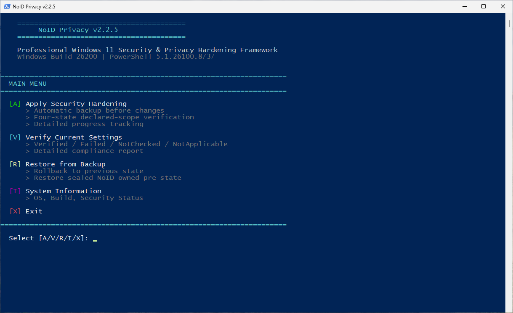

<div align="center">

# 🛡️ NoID Privacy

### Windows 11 Security & Privacy Hardening Framework

[](https://github.com/PowerShell/PowerShell)
[](https://www.microsoft.com/windows/)
[](LICENSE)
[](CHANGELOG.md)
[](https://github.com/NexusOne23/noid-privacy/stargazers)
[](https://github.com/NexusOne23/noid-privacy/commits)
[](https://noid-privacy.com)

**630+ default-decision declared checks • 7 modules • BAVR pattern (Backup-Apply-Verify-Restore)**

[📥 Quick Start](#-quick-start) • [📚 Documentation](#-documentation) • [🎯 Key Features](#-key-features) • [💬 Community](https://github.com/NexusOne23/noid-privacy/discussions)

</div>

<p align="center">
  <a href="Docs/screenshots/noid-privacy-windows-2.2.5-interactive-menu.png">
    
  </a>
</p>

<p align="center"><sub>NoID Privacy 2.2.5 interactive PowerShell menu on Windows 11 25H2 · click to enlarge</sub></p>

---

> **⚠️ DISCLAIMER:** This tool modifies Windows Registry and system state. It seals exact prestate for its declared mutation targets (BAVR pattern), not a full-machine backup. Always [create an independent system backup](#-system-backup-required) before running. Use at your own risk.

---

<details>
<summary><strong>⚠️ CRITICAL: Domain-Joined Systems & System Backup (click to expand)</strong></summary>

### 🏢 Domain-Joined Systems (Active Directory)

**WARNING:** This tool is **NOT recommended for production domain-joined systems** without AD team coordination!

- This tool writes effective local policy/security state; it does not create or edit AD Group Policy objects
- Domain Group Policy can overwrite overlapping local effective values during startup, sign-in, manual or background refresh
- Your hardening **may be reset automatically** by domain GPOs

**Recommended for:** Standalone systems, Home/Personal PCs, VMs, air-gapped systems, test/dev environments.

**For Enterprise/Domain Environments:** Integrate these settings into your Domain Group Policies instead!

### 💾 System Backup REQUIRED

**Before running this tool, create:**

1. **Windows System Restore Point** (recommended)
2. **Full System Image/Backup** (critical!)
3. **VM Snapshot** (if running in virtual machine)

The tool creates internal backups for rollback (BAVR pattern), but a full system backup protects against unforeseen issues, hardware failures, and configuration conflicts.

**Backup Tools:** Windows Backup, wbadmin, Macrium Reflect, Acronis, Hyper-V/VMware Snapshots.

</details>

---

## ⚡ In 30 Seconds

**What?** Microsoft Security Baseline + Advanced Hardening for Windows 11 24H2/25H2
**How?** PowerShell: **Backup** **Apply** **Verify** **Restore** with exact target-state restoration
**For whom?** Professionals, power users, SMBs **without Intune/Active Directory**

**630+ default-decision declared checks • 7 modules • exact BAVR for declared configuration targets**

---

## 🤔 Why "NoID Privacy" when it's mostly Security?

**Because security and privacy are inseparable. You can't have one without the other.**

**🛡️ Security Foundation**
- One 425-target profile derived from the MS Security Baseline for Win11 25H2 and safety-reviewed for supported 24H2/25H2 clients
- 19 Microsoft Edge v139 baseline values + 7 separately labelled privacy additions
- 19 rules: Attack Surface Reduction
- VBS + Credential Guard*: policy configuration for supported hardware/licensing

**🔒 Privacy Layer**
- DNS: Choose a documented public resolver with Windows DNS-over-HTTPS enforcement; filtering depends on the selected provider
- Telemetry: 3 modes (MSRecommended/Strict/Paranoid)
- AntiAI: 12 reversible AI policy groups (Recall, Copilot compatibility/agents, URI sources, Paint, Notepad, Edge, etc.)
- Bloatware removal is two-tier and explicit about its destructive boundary: policy/registry state restores exactly; sealed Tier 1/Tier 2 app identities enable separate original-user package re-registration with verified Store fallback, but deleted app data cannot be recovered

**🎯 The Result:** A documented, reversible hardening profile whose declared targets are verified explicitly.

*_Microsoft lists Credential Guard edition entitlement for Windows Enterprise and Education; hardware, firmware and licensing requirements still apply._

---

## 🌟 Why NoID Privacy?

<div align="center">

| **SECURITY** | **PRIVACY** | **RELIABILITY** | **SAFETY** |
|:---:|:---:|:---:|:---:|
| **Microsoft Baseline 25H2** | **AI Policy Hardening** | **Declared-Scope Verification** | **Reversible Design** |
| 630+ default-decision declared checks | Reversible AI policy hardening | Verification accounts for applied, failed and NotChecked targets | BAVR Architecture |
| 19 declared ASR rules (18 Windows-client applicable) | Telemetry & Ads Blocked | Detailed Logging | Exact Pre-State Restore |
| Legacy .lnk path-rule defense-in-depth | DNS-over-HTTPS (DoH) policy | Modular Design | Exact Scoped Pre-State |
| VBS & Credential Guard* | Edge policy hardening | Open Source / Auditable | Release-validated full profile: Windows 11 25H2 |

👉 [3-Minute Quick Start](#-quick-start) • 📖 [Full Feature List](Docs/FEATURES.md)

</div>

---

## 🚀 Implementation Contract

**Full BAVR pattern (Backup → Apply → Verify → Restore) • Windows inbox tools only • native Windows PowerShell 5.1**

| Property | NoID Privacy contract |
|:---|:---|
| **Focus** | 25H2 baseline-derived profile plus ASR, DNS, Privacy, AntiAI, Edge and AdvancedSecurity |
| **BAVR** | Backup → Apply → Verify → Restore for every declared configuration target; optional destructive app-removal effects have a separately documented non-exact boundary |
| **Verification** | Every declared target reconciles to Verified, Failed, NotChecked or NotApplicable |
| **Runtime dependencies** | Windows PowerShell 5.1 plus Windows inbox cmdlets/tools |
| **AI policy scope** | 43 typed registry targets plus 4 real URI source-hive checks, filtered by applicability |

🔄 **BAVR** = Backup-Apply-Verify-Restore (every declared configuration mutation requires sealed prestate and exact scoped verification)
✈️ **Air-Gapped operation** — no third-party download is required after installation; select DNS **Skip/KEEP** on a disconnected network

---

## 🔒 Engine Privacy Boundary

The open-source engine contains no usage telemetry, analytics SDK or license check. Its network-capable paths are explicit and user-scoped: resolver validation/configuration and optional GitHub installer/update downloads. Website behavior is outside this repository's verification scope.

> **Don't take our word for it — verify:** run `netstat -ano` (or Wireshark) while the tool runs. NoID Privacy sends no telemetry. Network activity is limited to explicitly selected operations: DNS pre-apply queries to the chosen resolver, normal Windows traffic after that resolver is configured, and optional GitHub release/update downloads.

---

## 🎯 Key Features

### 🔐 Security Baseline (425 Settings)

**Implements a 425-target profile derived from Microsoft's Windows 11 v25H2 Security Baseline, with documented NoID Privacy deviations.** The recorded 1,247,155-byte Microsoft package and every parsed identity/type/data item were compared against the embedded profile; `RDVDenyWriteAccess` (BitLocker USB, 1→0) and `SubmitSamplesConsent` (Defender sample submission, 3→1 safe samples only) are the two declared data deviations, each restorable to Microsoft's value through its documented Apply choice. See [SecurityBaseline provenance and deviations](Docs/SECURITY-BASELINE-PROVENANCE.md).
- **335 Registry Policies** Computer + User Configuration
- **67 Security Template Settings** Password Policy, Account Lockout, User Rights, Security Options
- **23 Advanced Audit Policies** Exact selected audit-subcategory state
- **Credential Guard*** Configures VBS-backed isolation of supported credential secrets on entitled, compatible devices
- **BitLocker Policies** USB drive protection, enhanced PIN, DMA attack prevention
- **VBS & HVCI** Virtualization-based security

### 🛡️ Attack Surface Reduction (19 Rules)

**19 declared ASR rules: 16 applicable Block defaults + 2 configurable + 1 Exchange-server-only NotApplicable**
- Helps block common ransomware, macro, exploit, and credential theft techniques
- Office/Adobe/Email protection
- Script & executable blocking
- PSExec/WMI: Audit mode (if management tools used), Block otherwise
- New/Unknown Software: Audit mode (if installing untrusted software), Block otherwise

### 🌐 Secure DNS (3 Providers)

**DNS-over-HTTPS with Secure Default (REQUIRE)**
- **Quad9** (Default) Security-focused, malware blocking, 9.9.9.9
- **Cloudflare** Unfiltered resolver with documented, independently audited privacy commitments, 1.1.1.1
- **AdGuard** Ad/tracker blocking built-in
- REQUIRE mode (default): no unencrypted fallback
- ALLOW mode (optional): fallback allowed for VPN/mobile/enterprise networks
- IPv4 + IPv6 dual-stack support

### 🔒 Privacy Hardening (63 default-decision declared targets: 36 base + 27 Tier 1 policy values)

**3 Operating Modes**
- **MSRecommended** (Default) least-disruptive selected policy/registry controls; preserves stricter existing app-permission policy
- **Strict** selected deny/disable controls (AllowTelemetry=0 is effective as Diagnostic Data Off only where the edition supports it; other app-permission policy is preserved)
- **Paranoid** Broadest declared deny/disable policy set; may disrupt conferencing and other apps that require denied permissions

**Features:**
- Diagnostic-data policy is set per selected mode; effective level remains edition-dependent
- Two-tier bloatware removal, honest about restore guarantees:
  - **Tier 1** (opt-in, default No): Microsoft's native `RemoveDefaultMicrosoftStorePackages` policy, Enterprise/Education Windows 11 24H2/build 26100+ only; its 27 policy values restore exactly, and a sealed original-user inventory feeds the separate non-exact app recovery; deleted data remains unrecoverable; NotApplicable elsewhere
  - **Tier 2** (best-effort, opt-in, default No): classic per-user AppX removal on any edition; separate `Restore-BloatwareApps` first re-registers recorded staged package families and uses verified current Store products through winget only as fallback
- HKCU targets apply to the current interactive desktop user; offline profiles remain untouched
- OneDrive feedback/sync-health reporting disabled; existing Personal OneDrive policy is preserved
- App permissions configurable per mode

### 🤖 AI Policy Hardening (43 Registry Targets + 4 URI Checks)

**12 reversible groups are configured and exact owned state is verified**
- **AppPrivacy** Force-denies documented generative-AI app access
- **Windows Recall** Configures component-availability/snapshot policies and scoped protection policies
- **Windows Copilot** Legacy/user UI controls + hardware key remap; current MSIX app is not claimed removed
- **Click to Do** permanent policy applied on documented servicing levels/editions; the feature itself remains Copilot+/eligible-Cloud-PC-only
- **Paint AI** Cocreator, Generative Fill and Image Creator policies configured; current Paint can retain Generative Erase because Microsoft publishes no corresponding policy
- **Notepad AI** GPT writing tools disabled on supported Notepad versions
- **Settings Agent** permanent policy applied on documented servicing levels and commercial editions; runtime presence remains Copilot+-only

Build/edition/Insider/product caveats and the explicit current-Copilot AppLocker enforcement gap are tracked in [Windows 11 AI applicability](Docs/WINDOWS-AI-APPLICABILITY.md). The separately confirmed destructive Privacy app tiers can uninstall the exact Copilot package but do not prevent reinstall or restore app data exactly.

Privacy target provenance, corrected user/device hives, edition applicability and the exact-state/runtime boundary are tracked in [Privacy policy provenance](Docs/PRIVACY-POLICY-PROVENANCE.md).

The complete 2026 Microsoft primary-source review, including controls intentionally excluded for UX, lifecycle or exact-recovery reasons, is recorded in [Windows 11 security and privacy primary-source review (2026)](Docs/SECURITY-PRIVACY-PRIMARY-SOURCE-REVIEW-2026.md).

### 🌐 Edge Hardening (26 Policies)

**Microsoft Edge Security Baseline**
- SmartScreen enforced when the documented managed-Windows prerequisite is applicable
- Tracking Prevention strict
- SSL/error-override and legacy-auth policy hardening
- Extension security
- IE Mode restrictions

### 🔧 Advanced Security (60 Declared Checks)

**Beyond Microsoft Baseline**
- **Legacy SRP .lnk path rules** — exact registry configuration only; runtime enforcement is not claimed and Microsoft recommends WDAC/AppLocker
- **RDP Hardening** — Disabled by default, TLS + NLA enforced
- **Wireless Display Security** — exact Miracast/Wireless Display policy, service, adapter and firewall state
- **Legacy Protocol Hardening** — NetBIOS adapter/service/firewall state, LLMNR firewall state and WPAD auto-discovery; the Security Baseline separately owns SMBv1 and LLMNR policy targets. Microsoft removed Windows PowerShell 2.0 from updated 24H2 and later, so it is no longer a new-run target. The legacy reader still recognizes historical sealed artifacts and restores them only while Windows exposes the recorded feature identity; otherwise Restore fails closed instead of claiming success.
- **TLS Hardening** — disables SCHANNEL TLS 1.0/1.1 client and server state; it does not force-enable later TLS versions
- **UPnP/SSDP Blocking** — disables selected discovery services and blocks the module-owned traffic rules
- **Discovery Protocols** — Optional WS-Discovery + mDNS disable (Maximum profile)
- **Windows Update** — Interactive configuration
- **Finger Protocol** — module-owned TCP/79 block rules as legacy-protocol defense-in-depth

📖 [Detailed Feature Documentation](Docs/FEATURES.md)

---

## 🔄 BAVR Pattern

**Every declared mutation must have sealed prestate, an exact target definition, and post-Apply/post-Restore verification.**

```
[1/4] BACKUP Exact prestate for the module-owned targets before changes
[2/4] APPLY Owned targets applied with structured result/error logging
[3/4] VERIFY Automated compliance checks confirm what was applied
[4/4] RESTORE One command restores every sealed target in the selected session
```

**What this means in practice:**
- **BAVR for all declared settings** — every configuration target NoID Privacy writes is backed up and re-checkable; opted-in app removal explicitly warns where downstream app/data recovery is not exact
- **Fail-closed error handling** — advanced functions, structured logs, no successful module result after a failed required target
- **Typed restore coverage** — owned Registry, service, scheduled-task, DNS, firewall and adapter state
- **Runtime contract:** Windows PowerShell 5.1 on Windows 11; the same 25H2-derived SecurityBaseline target/BAVR contract supports 24H2 and 25H2. The complete seven-module release matrix remains evidence-scoped per [the VM release gate](Docs/WINDOWS-VM-RELEASE-GATE.md). An explicitly reported Windows 11 26H2 preview is admitted as Experimental and runs applicable targets through full BAVR, but is not runtime-validated or release-approved.

Pre-publication client evidence is captured with the [Windows 11 release acceptance gate](Docs/WINDOWS-VM-RELEASE-GATE.md).

---

## ⚠️ What This Does NOT Protect Against

**Important Limitations:**

| Threat | Why Not Protected |
|--------|-------------------|
| **Social Engineering** | If users deliberately bypass all warnings and run malicious files |
| **Supply-Chain Attacks** | Malware embedded in legitimate signed software |
| **Physical Access** | Stolen device without BitLocker (use BitLocker!) |
| **Nation-State Actors** | Sophisticated targeted attacks require enterprise EDR/XDR |
| **Zero-Day Exploits** | Unknown vulnerabilities not yet patched by Microsoft |

**What you need additionally:**
- **Regular Windows Updates** — Critical for security patches
- **BitLocker** — For lost/stolen device protection
- **User Awareness** — Don't click suspicious links/attachments
- **Backups** — 3-2-1 backup strategy for ransomware resilience

> **NoID Privacy hardens your system significantly, but no security solution provides 100% protection.**
> Defense in depth is always recommended.

---

## 📥 Quick Start

### ⚡ Reviewed Bootstrap Install

**Step 1:** Open PowerShell as Administrator
- Press `Win + X` → Click **"Terminal (Admin)"**

**Step 2:** Run installer

```powershell
# Download from the exact reviewed repository tag; do not pipe network content to execution.
$installer = Join-Path $env:TEMP 'NoIDPrivacy-install-v2.2.5.ps1'
Invoke-WebRequest -Uri 'https://raw.githubusercontent.com/NexusOne23/noid-privacy/v2.2.5/install.ps1' -OutFile $installer -UseBasicParsing

# Inspect or independently compare this exact local file before executing it.
Get-Content -LiteralPath $installer

# Windows blocks downloaded scripts. Start the inspected file in Windows
# PowerShell 5.1; Bypass applies to this process only, not to the machine.
& "$env:SystemRoot\System32\WindowsPowerShell\v1.0\powershell.exe" -NoProfile -ExecutionPolicy Bypass -File $installer
```

Two Windows defaults block a downloaded script: the `Restricted` client execution policy and the internet mark-of-the-web. `Start-NoIDPrivacy.bat` uses the same process-scoped start, and nothing has to be undone afterwards. Where Group Policy sets the execution policy, that setting wins and the process value is ignored.

**What it does:**
1. Checks Administrator privileges
2. Verifies a recognized Windows 11 client profile; one 25H2-derived SecurityBaseline profile and BAVR contract is admitted on 24H2/25H2, while an explicitly reported Windows 11 26H2 preview is admitted only as an Experimental full-BAVR path and is not runtime-validated or release-approved
3. Resolves an exact tagged release and requires its exact ZIP plus `CHECKSUMS.sha256`
4. Verifies the ZIP and rejects unsafe archive paths/types/resource bounds before extraction, validates version/syntax/JSON in same-volume staging, then swaps the installation with rollback protection
5. Unblocks the staged PowerShell files and starts interactive mode

The installer fails closed if GitHub is unavailable, the tagged assets are ambiguous/missing, the checksum differs, or staged validation fails. It never falls back to an unverified main-branch archive.

The release ZIP is authenticated by its manifest. The bootstrap remains a separate trust boundary, so it is downloaded from an exact tag and inspected or independently verified before local execution; see [Security Best Practices](SECURITY.md#-security-best-practices-for-users).

**Alternative - Manual Install:**

```powershell
# 1. Clone repository
git clone https://github.com/NexusOne23/noid-privacy.git
cd noid-privacy

# 2. Run as Admin
.\Start-NoIDPrivacy.bat

# 3. Verify after reboot
.\Tools\Verify-Complete-Hardening.ps1
```

> **Downloaded ZIP?** Run `Start-NoIDPrivacy.bat` - it automatically unblocks all files!

---

## 🀄 中文簡介 | 中文简介

**繁體中文：** NoID Privacy 是 Windows 11 安全與隱私強化框架：630+ 項預設決策檢查、7 大模組，以 BAVR（備份 → 套用 → 驗證 → 還原）確保每項變更皆可回復。免費、開源（GPL-3.0）；商業版 NoID Privacy Pro 提供圖形介面。完整中文介紹請見官網：[noid-privacy.com（繁體中文）](https://noid-privacy.com/index-zh-hant.html)

**简体中文：** NoID Privacy 是 Windows 11 安全与隐私加固框架：630+ 项默认决策检查、7 大模块，以 BAVR（备份 → 应用 → 验证 → 恢复）确保每项更改均可回退。免费、开源（GPL-3.0）；商业版 NoID Privacy Pro 提供图形界面。完整中文介绍请见官网：[noid-privacy.com（简体中文）](https://noid-privacy.com/index-zh-hans.html)

---

## 💻 Usage Examples

### Interactive Mode (Recommended)

```powershell
# Start interactive menu
.\Start-NoIDPrivacy.bat

# Follow prompts:
# 1. Select modules (all or custom)
# 2. Choose settings (DNS provider, Privacy mode, etc.)
# 3. Automatic backup → apply → verify
# 4. Reboot prompt
```

### Direct Execution

```powershell
# Apply all modules
.\NoIDPrivacy.ps1 -Module All

# Apply specific module
.\NoIDPrivacy.ps1 -Module Privacy

# Dry-run (no changes)
.\NoIDPrivacy.ps1 -Module All -DryRun
```

### Verification

```powershell
# Full verification (active canonical target set)
.\Tools\Verify-Complete-Hardening.ps1

# The report reconciles every declared target into exactly one state:
# Verified, Failed, NotChecked, or NotApplicable.
# Counts are loaded from Config/SettingsCounts.json and module target inventories;
# no hard-coded success count is authoritative.
```

### Restore

```powershell
# Restore via the interactive menu
.\Start-NoIDPrivacy.bat
# Select [R] Restore from Backup, then pick a session
```

Backup sessions use a collision-resistant visible ID containing timestamp,
milliseconds and a random nonce. They are retained indefinitely: the framework
has no age-, count- or size-based backup cleanup. Every directory found in the
backup root is listed, including renamed, legacy, hidden, damaged and unsealed
folders. A failed pre-Apply backup is detached from the active session, retained
with its own file/hash inventory and labelled `Incomplete backup: <module>`.
Damaged or incomplete records remain visible with their validation reason, but
never authorize Restore. Only an explicit user deletion outside the framework
can remove a backup directory.

A session restores exactly the targets it sealed, and its scope follows the
options chosen in that run: a run that declines an optional target does not back
that target up, so a later session can cover less than an earlier one. Restoring
a session does not consume it — the same session can be restored again, and the
list records when it was last restored.

> **⚠️ Backup compatibility across versions:** Backups created by
> **NoID Privacy 2.2.4 or earlier** use the pre-BAVR-v2 format and **cannot be
> restored by 2.2.5 or later** (the restore engine rejects them fail-closed
> before touching any system state — the old backup itself stays intact on
> disk). If you may still need an old backup, either restore it **before**
> upgrading or keep the matching older release around to restore it later.
> After upgrading, create a fresh backup with the new version; from then on
> the sealed BAVR-v2 format applies.

---

## 📊 Module Overview

> Counts below are mirrored from [`Config/SettingsCounts.json`](Config/SettingsCounts.json),
> the canonical source consumed by `Tools/Verify-Complete-Hardening.ps1` and every
> module's "Applied N settings" log marker. Update the JSON and the verifier and
> module reports follow automatically; this table is documentation only.

| Module | Settings | Description | Status |
|--------|----------|-------------|--------|
| **SecurityBaseline** | 425 | One 25H2-derived Microsoft Security Baseline target set, release-gated for Windows 11 24H2 and 25H2 | v2.2.5 |
| **ASR** | 19 | Attack Surface Reduction Rules | v2.2.5 |
| **DNS** | 5 | Exact IPv4/IPv6 resolver, DoH registration, native per-adapter encrypted-state/UI and fallback-policy aggregates | v2.2.5 |
| **Privacy** | 63 default | Non-relaxing telemetry, labelled interactive-user preferences, OneDrive/Store hardening and opt-in Tier 1 policy app removal (36 base + 27 policy targets; Strict 88, Paranoid 117 declared). Tier 2 per-user removal incl. Copilot stays a separate uncounted opt-in; details in [FEATURES](Docs/FEATURES.md) | v2.2.5 |
| **AntiAI** | 47 | Reversible AI hardening (43 registry + 4 URI checks across 12 groups) | v2.2.5 |
| **EdgeHardening** | 26 | 19 Microsoft Edge v139 baseline values + 7 explicit privacy additions; default selects 25; managed-Windows and Edge-version prerequisites are reported per target | v2.2.5 |
| **AdvancedSecurity** | 60 | Beyond MS Baseline (17 deterministic firewall targets + 43 non-firewall checks; unsupported Home-edition policy/host targets are NotApplicable) | v2.2.5 |
| **TOTAL** | **645** | All 7 modules with canonical default decisions; actual declared/applicable count varies by mode, edition, build, and explicit selection/skip decisions ¹ | **v2.2.5** |

¹ On Windows 11, Microsoft's support matrix makes the Exchange Webshell rule NotApplicable, leaving 18 applicable ASR rules. With a third-party endpoint product as the primary engine, those 18 are NotChecked rather than passed; the other 626 declared checks remain outside ASR. Host-specific `NotApplicable` and unselected-option `NotChecked` states remain in the declared total — see [Antivirus Compatibility](#antivirus-compatibility).

**Release Highlights:**

- **v2.2.5:** Quality & robustness release — backup/restore symmetry work, exact-BAVR and verification hardening across all seven modules, and CI safety nets (module-GUID validation, canonical count checks and tag checksum generation); release-validated on Windows 11 Pro 25H2. Release evidence is recorded from the exact audited tree; historical pass counts are not reused as current certification.
- **v2.2.4:** Third-party endpoint-product detection — ASR is reported Skipped/NotChecked when Defender is not positively proven as the primary active engine ([#15](https://github.com/NexusOne23/noid-privacy/issues/15))
- **v2.2.3:** Restore Mode crash fix, Recall snapshot storage verification fix ([#14](https://github.com/NexusOne23/noid-privacy/issues/14))
- **v2.2.2:** Firewall snapshot 60-120s → 2-5s (batch query performance fix)
- **v2.2.1:** Multi-run session bug fix, `.Count` property bug in 5 files
- **v2.2.0:** Verification coverage extended to all 7 modules (EdgeHardening + AdvancedSecurity added), SRP .lnk protection, RDP/TLS hardening, legacy protocol blocking

📖 [Detailed Module Documentation](Docs/FEATURES.md)

🔎 [Microsoft Edge v139 provenance, exact package hash and deviations](Docs/EDGE-POLICY-PROVENANCE.md)

---

## ✅ Intended Use

### **Ideal Use Cases**

**Small/Medium Business (SMB)**
- No Active Directory/Intune licenses
- Cloud-first (Microsoft 365, Google Workspace)
- Remote/hybrid work security
- Compliance without enterprise infrastructure

**Freelancers & Consultants**
- Client data protection
- Secure workstations without domain
- Professional security standards
- Safer experimentation through sealed, module-scoped backups; keep an independent system/image backup for failures outside the declared target scope

**Power Users & Privacy-Conscious**
- Real security, not just "debloat"
- AI/Telemetry lockdown
- Understand every setting
- Declared-target control plus sealed restore evidence

**IT Pros Without Intune**
- Standalone Windows 11 hardening
- Microsoft Baseline compliance locally
- Quick deploy for clients
- No domain controller required

### **Not Ideal For**

**Enterprise with Intune/AD**
- Use [Microsoft Security Baselines](https://learn.microsoft.com/en-us/windows/security/operating-system-security/device-management/windows-security-configuration-framework/security-compliance-toolkit-10) with Group Policy instead

**Windows 10 or Older**
- This tool is designed for recognized Windows 11 client profiles only

**Legacy Software Dependencies**
- If you rely on unsafe SMB1/RPC/DCOM

**Strict MDM Reporting**
- If compliance must be centrally reported

---

## ⚙️ Requirements & Compatibility

### Hardware & OS

NoID Privacy is designed for modern Windows 11 client systems.

NoID Privacy targets current Windows 11 client releases, but application and hardware compatibility still depends on the selected hardening profile:

- **OS:** The same 25H2-derived SecurityBaseline profile is admitted on supported Windows 11 24H2 and 25H2 with one BAVR contract. Other modules retain their own build/edition target applicability. An explicitly reported Windows 11 26H2 preview is admitted as Experimental: applicable targets execute through Backup, Apply, Verify/HTML and Restore, but that path is not runtime-validated or release-approved.
- **CPU/architecture:** x64 (AMD64/x86-64) only, on Microsoft's [Windows 11 supported processor list](https://learn.microsoft.com/en-us/windows-hardware/design/minimum/windows-processor-requirements). Windows on Arm (ARM64) is not supported; x64 emulation on ARM64 is not a NoID Privacy support path
- **Firmware/TPM:** individual hardware-backed protections have different requirements. Secure Boot and virtualization are required for [Credential Guard](https://learn.microsoft.com/en-us/windows/security/identity-protection/credential-guard/); Microsoft lists TPM as recommended hardware binding there. [BitLocker startup behavior](https://learn.microsoft.com/en-us/windows/security/operating-system-security/data-protection/bitlocker/configure#require-additional-authentication-at-startup) depends on its chosen TPM/non-TPM policy. NoID Privacy's hardware report separately exposes TPM 2.0, SLAT and query status instead of treating every protection alike
- **RAM:** 8 GB minimum, 16 GB recommended for VBS
- **Admin Rights:** Required
- **Shell:** Windows PowerShell 5.1

> Use DryRun and the compatibility report before Apply; official Windows 11 eligibility alone cannot prove that every selected hardening choice fits local applications, peripherals, VPNs or management tooling.

**Support profile:**

| OS Version | Status |
|------------|--------|
| Windows 11 25H2 (Build 26200–26299) | Full profile target and current release-validation scope |
| Windows 11 24H2 (Build 26100–26199) | Supported SecurityBaseline path using the same safety-reviewed 25H2-derived 425-target/BAVR contract; other targets remain module-/build-/edition-aware |
| Windows 11 26H2 official preview (Build 26300–27999 with `DisplayVersion=26H2`) | Experimental full-BAVR apply path for enabled/applicable targets; not runtime-validated or release-approved in the current 25H2 gate |
| Windows on Arm (ARM64), including Windows 11 26H1 Snapdragon devices | ❌ Not Supported; NoID Privacy requires native x64 (AMD64/x86-64) Windows |
| Windows 11 23H2 or older | ❌ Not Supported |

### Legacy Devices & Protocols

The **AdvancedSecurity** and **SecurityBaseline** modules intentionally disable legacy and insecure protocols:

- **TLS 1.0/1.1** (TLS 1.2+ required)
- **NetBIOS** name resolution, **LLMNR**, **WPAD**
- Microsoft-removed Windows PowerShell 2.0 is not queried or changed by new runs
- **Administrative-share policy** can prevent automatic administrative shares after reboot when that choice is selected; existing system-managed C$/ADMIN$ shares are not recreated or deleted live
- **NTLMv1/LM** authentication (NTLMv2 only)

This can affect **very old hardware and software**, for example:

- NAS, printers, IP cameras, and IoT devices that only support TLS 1.0/1.1
- Legacy Windows systems (XP, 7) and old Samba implementations
- Old management tools that rely on hidden admin shares

If you still depend on legacy devices, use the built-in **BAVR** pattern (Backup → Apply → Verify → Restore) to roll back if something breaks.

<a id="antivirus-compatibility"></a>
### 🛡️ Antivirus Compatibility

#### Microsoft Defender vs. Third-Party Endpoint Products

NoID Privacy does not replace or certify an antivirus/EDR product. It queries Windows/Defender state to decide whether the Defender-specific ASR module is applicable:

| Your Setup | NoID Privacy Modules Applied | Modules Skipped |
|------------|----------------------|-----------------|
| **Microsoft Defender as primary engine** | All 7 modules — SecurityBaseline, ASR, DNS, Privacy, AntiAI, Edge, AdvancedSecurity | None |
| **Third-party endpoint product as primary** (any vendor — consumer AV or enterprise EDR/XDR) | 6 modules — SecurityBaseline, DNS, Privacy, AntiAI, Edge, AdvancedSecurity | ASR (see note below) |

> **Why ASR is Defender-specific:** ASR (Attack Surface Reduction) is a set of Microsoft
> Defender controls. NoID Privacy applies its declared targets through Defender's native device-policy
> values and verifies the resulting effective state with `Get-MpPreference`.
> When Defender is not the primary engine, NoID Privacy cannot configure or verify ASR rules.
>
> A skipped ASR module makes no statement about the quality or configuration of the other endpoint product. NoID Privacy cannot read vendor-specific controls and therefore does not attempt to verify them.
>
> **Recommendation if you run a third-party endpoint product:** consult your vendor's
> documentation or management console to confirm equivalent attack-surface-reduction
> features are enabled. The other 6 NoID Privacy modules are unaffected.

When a third-party endpoint product is detected, NoID Privacy shows a clear notification:

```
========================================
  ASR Module Skipped
========================================

Third-party endpoint product detected: <Product Name>

ASR (Attack Surface Reduction) is a Microsoft-Defender-specific API and
cannot be configured by NoID Privacy when Defender is not the primary engine.

NoID Privacy cannot verify vendor-specific attack-surface-reduction controls. Consult the vendor's documentation or
management console to confirm equivalent protections are enabled.

This is NOT an error - ASR will be skipped.
```

**The other modules are not skipped solely because of the endpoint product; their own edition, feature, firewall-controller and user-choice applicability rules still apply.**

---

## 🔒 Security & Quality

### Code Quality

- **PSScriptAnalyzer:** `Invoke-ScriptAnalyzer -Path . -Recurse -Settings ./PSScriptAnalyzerSettings.psd1` runs in CI on every push and pull request and rejects any Error, Warning or ParseError under the canonical `PSScriptAnalyzerSettings.psd1`. The dated 0-finding pass from this release cycle (PSScriptAnalyzer 1.25.0, Windows PowerShell 5.1) is recorded in [Release Notes 2.2.5](Docs/RELEASE-NOTES-2.2.5.md).
- **Pester Tests:** `Tests/Unit` and `Tests/Integration` run under Pester 5.9.0 in CI on every push and pull request and fail the build on any failure or on an empty run; `Tests\Run-AllTests.ps1` runs the same suites locally and emits a timestamped NUnit artifact. Dated validation passes from this release cycle remain recorded in [Release Notes 2.2.5](Docs/RELEASE-NOTES-2.2.5.md); the generated artifact from the current gate is the authority for the current suite.
- **Verification:** the complete active target set is checked by `Tools\Verify-Complete-Hardening.ps1`
- Structured error reporting and logging on the declared execution paths
- Advanced functions, `CmdletBinding`, validated parameters and `SupportsShouldProcess` where exposed mutation helpers use PowerShell confirmation semantics

### What This Tool Does

- Applies the documented 425-target profile derived from the recorded Windows 11 v25H2 baseline package plus the additional NoID Privacy modules; all source entries match except the declared `RDVDenyWriteAccess` 1→0 and `SubmitSamplesConsent` 3→1 decisions
- Adds supplemental legacy .lnk path rules while explicitly not claiming complete CVE mitigation or runtime SRP enforcement
- Applies the selected diagnostic-data/privacy controls with edition-aware effectiveness and exact state reporting
- Applies applicable documented AI policy state; it does not itself remove the current Copilot MSIX app or claim universal runtime suppression. Exact Copilot package removal is confined to the separately confirmed destructive Privacy app tiers
- Configures BitLocker policies, Credential Guard*, VBS

### What This Tool Does NOT Do

- Install, replace or certify antivirus/EDR software; ASR configuration runs only with positive Defender-primary evidence
- Create or manage AD/Intune policy objects
- Modify BIOS/UEFI settings
- Guarantee application, peripheral, VPN or management-tool compatibility
- Prevent re-enabling features

### Reversibility

- **Restored exactly:** owned registry values and types, service/task state, firewall state, DNS state, declared AI/Edge targets, and the Tier 1 policy-based bloatware-removal prestate
- **AppX safety boundary (Tier 2 only):** classic per-user app removal is a best-effort action; winget reinstall cannot reproduce exact prior package/provisioning state, so restore is a separate, explicitly non-exact `Restore-BloatwareApps` step, never automatic
- **Backup system:** sealed, hashed, target-specific prestate captured before Apply
- **Documented operations:** module decisions, mutations and failures are written to local operational logs; review logs before sharing

---

## ⚙️ Configuration

### Default Settings

Defaults are an explicit security/usability choice, not a universal compatibility guarantee:
- Services: Telemetry services controlled, critical services protected
- Firewall: Inbound blocked, outbound allowed
- Privacy: MSRecommended applies its least-disruptive non-relaxing target plan; Strict and Paranoid add progressively broader deny policies
- BitLocker: Policies set, user must enable manually
- AI policy targets: applicable subset uses exact typed registry BAVR; inapplicable targets remain untouched, while current Copilot AppX enforcement is explicitly outside this profile

### Customization

Freeze supported user decisions in `config.json`; the module JSON files are canonical target inventories and are not casual preference files:

```powershell
# Review the shipped decision schema, then set options.nonInteractive=true
notepad.exe .\config.json
```

Maintainers who change a canonical module inventory must also update applicability, exact backup/apply/verify/restore logic, `Config/SettingsCounts.json`, provenance and deterministic tests. For a temporary ASR file exception, use the narrow procedure in the [Troubleshooting Guide](Docs/TROUBLESHOOTING.md#allow-specific-files-while-keeping-hardening-on-per-file); do not add local paths to `ASR-Rules.json`.

---

## 🔧 Troubleshooting

Common issues and step-by-step fixes — running as Administrator, VBS/Credential Guard, BitLocker, **relaxing the ASR rule / SmartScreen that can block software installs**, Windows Insider compatibility, and where to find logs — live in the dedicated guide:

📖 **[Troubleshooting Guide](Docs/TROUBLESHOOTING.md)**

**Quick pointers:**
- **"Access Denied"** → run PowerShell as Administrator.
- **Can't install downloaded software after hardening?** → [narrow ASR exception and audited compatibility steps](Docs/TROUBLESHOOTING.md#allow-specific-files-while-keeping-hardening-on-per-file). The cleanest reset is the interactive **`[R]` Restore from Backup** menu.
- **Logs:** `Logs/NoIDPrivacy_YYYYMMDD_HHMMSS_fff_<nonce>.log`

---

## 📚 Documentation

### Core Documentation
- **[Features](Docs/FEATURES.md)** - Declared settings and decision reference
- **[Changelog](CHANGELOG.md)** - Version history
- **[Quick Start](#-quick-start)** - Installation guide (see above)
- **[Troubleshooting](Docs/TROUBLESHOOTING.md)** - Common issues & step-by-step fixes

### 💬 Community

- **[💬 Discussions](https://github.com/NexusOne23/noid-privacy/discussions)** - Questions and ideas
- **[🐛 Issues](https://github.com/NexusOne23/noid-privacy/issues)** - Bug reports only
- **[📚 Documentation](Docs/FEATURES.md)** - Declared feature reference

---

## 🙏 Acknowledgments

- **Microsoft Security Baseline Team** for Windows 11 25H2 guidance
- **PowerShell Community** for best practices and patterns
- **Open Source Contributors** for testing and feedback

---

## 🔗 The NoID Privacy Ecosystem

| Platform              | Link |
|-----------------------|------|
| 🌐&nbsp;**Website**      | [NoID-Privacy.com](https://noid-privacy.com) — all platforms, pricing, and docs |
| 🪟&nbsp;**Windows**      | You're here! |
| 🐧&nbsp;**Linux**        | [NoID Privacy for Linux](https://github.com/NexusOne23/noid-privacy-linux) — read-only Bash posture audit |
| 🏰&nbsp;**Workstation**  | [NoID Privacy Workstation 44](https://github.com/NexusOne23/noid-privacy-workstation) — hardened Fedora 44 / GNOME 50 privacy OS |
| 📱&nbsp;**Android**      | [NoID Privacy for Android](https://play.google.com/store/apps/details?id=com.noid.privacy) — device + Google-account privacy audit |

---

## 📜 License

### Dual-License Model

NoID Privacy is available under a **dual-licensing** model:

#### 🆓 Open Source License (GPL v3.0)

**For individuals, researchers, and open-source projects:**

This project is licensed under the **GNU General Public License v3.0** (GPL-3.0).

✅ **You CAN:**
- ✔️ Use the software freely for personal and commercial purposes
- ✔️ Modify the source code
- ✔️ Distribute the software
- ✔️ Distribute your modifications

⚠️ **You MUST:**
- 📝 Disclose your source code when distributing
- 🔓 License your modifications under GPL v3.0
- 📄 Include the original copyright notice
- 📋 State significant changes made to the software

[Read the full GPL v3.0 License](LICENSE)

#### 💼 Commercial License

**For companies and organizations that want to:**
- Integrate this software into closed-source/proprietary products
- Distribute this software without disclosing source code
- Receive dedicated commercial support and warranties
- Avoid GPL v3.0 copyleft requirements

**Contact:**
- **GitHub:** [💬 Discussions](https://github.com/NexusOne23/noid-privacy/discussions)

---

### Third-Party Components

This software implements security configurations based on:
- **Microsoft Security Baselines** - Public documentation
- **Microsoft Defender ASR Rules** - Official documentation
- **DNS Providers** - Cloudflare, Quad9, AdGuard (public services)

Microsoft, Windows, and Edge are trademarks of Microsoft Corporation. This project is not affiliated with Microsoft.

---

## ⚠️ Disclaimer

This script modifies critical system settings. Use at your own risk. Always:
1. **Create a system backup** before running
2. **Test in a VM** first
3. **Review the code** to understand changes
4. **Verify compatibility** with your environment

The authors are not responsible for any damage or data loss.

---

## 📈 Project Status

**Current release:** 2.2.5 (Windows 11 Pro 25H2 validated). See the [Changelog](CHANGELOG.md) for the release notes.

---

<div align="center">

**Made with 🛡️ for the Windows Security Community**

[Report Bug](https://github.com/NexusOne23/noid-privacy/issues) · [Request Feature](https://github.com/NexusOne23/noid-privacy/issues) · [Discussions](https://github.com/NexusOne23/noid-privacy/discussions) · [Website](https://noid-privacy.com)

**[⭐ Star this repo](https://github.com/NexusOne23/noid-privacy)** if you find it useful!

</div>
