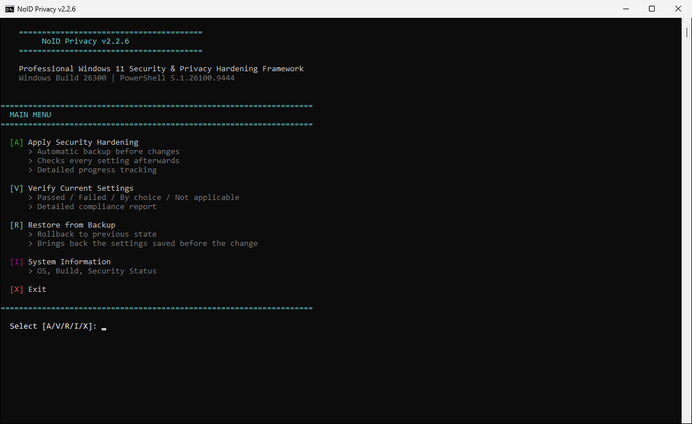

<div align="center">

# 🛡️ NoID Privacy

### Security & Privacy Hardening for Windows 11 26H2

**Also supports Windows 11 24H2 and 25H2 · native x64 · Windows PowerShell 5.1**

[](https://learn.microsoft.com/en-us/powershell/scripting/overview)
[](https://www.microsoft.com/windows/)
[](LICENSE)
[](CHANGELOG.md)
[](https://github.com/NexusOne23/noid-privacy/stargazers)
[](https://github.com/NexusOne23/noid-privacy/commits)
[](https://noid-privacy.com)

**630+ default-decision declared checks • 7 modules • BAVR pattern (Backup-Apply-Verify-Restore)**

[📥 Quick Start](#-quick-start) • [📚 Documentation](#-documentation) • [🎯 Key Features](#-key-features) • [💬 Community](https://github.com/NexusOne23/noid-privacy/discussions)

</div>

<p align="center">
  <a href="Docs/screenshots/noid-privacy-windows-2.2.6-interactive-menu.png">
    
  </a>
</p>

<p align="center"><sub>NoID Privacy 2.2.6 interactive PowerShell menu on Windows 11 26H2 · click to enlarge</sub></p>

---

> **⚠️ DISCLAIMER:** This tool modifies Windows Registry and system state. It seals exact prestate for its declared mutation targets (BAVR pattern), not a full-machine backup. Always [create an independent system backup](#-system-backup-required) before running. Use at your own risk.

---

<details>
<summary><strong>⚠️ CRITICAL: Domain-Joined Systems & System Backup (click to expand)</strong></summary>

### 🏢 Domain-Joined Systems (Active Directory)

**WARNING:** This tool is **NOT recommended for production domain-joined systems** without AD team coordination!

- This tool writes effective local policy/security state; it does not create or edit AD Group Policy objects
- Domain Group Policy can overwrite overlapping local effective values during startup, sign-in, manual or background refresh
- Your hardening **may be reset automatically** by domain GPOs

**Recommended for:** Standalone systems, Home/Personal PCs, VMs, air-gapped systems, test/dev environments.

**For Enterprise/Domain Environments:** Integrate these settings into your Domain Group Policies instead!

### 💾 System Backup REQUIRED

**Before running this tool, create:**

1. **Windows System Restore Point** (recommended)
2. **Full System Image/Backup** (critical!)
3. **VM Snapshot** (if running in virtual machine)

The tool creates internal backups for rollback (BAVR pattern), but a full system backup protects against unforeseen issues, hardware failures, and configuration conflicts.

Choose and test an independent full-system recovery method. A settings-sync
backup or NoID's target snapshots do not replace a system image.

</details>

---

## ⚡ In 30 Seconds

**What?** Microsoft Security Baseline (26H2-derived) + Advanced Hardening for Windows 11 24H2/25H2/26H2
**How?** PowerShell: **Backup** **Apply** **Verify** **Restore** with exact target-state restoration
**For whom?** Professionals, power users, SMBs **without Intune/Active Directory**

**630+ default-decision declared checks • 7 modules • exact BAVR for declared configuration targets**

---

## 🤔 Why "NoID Privacy" when it's mostly Security?

**Because security and privacy are inseparable. You can't have one without the other.**

**🛡️ Security Foundation**
- One 425-target profile derived from the MS Security Baseline for Win11 26H2 and safety-reviewed for fully supported 24H2/25H2/26H2 clients
- 24 Microsoft Edge v151 baseline values + 7 separately labelled privacy additions
- 19 rules: Attack Surface Reduction
- VBS + Credential Guard*: policy configuration for supported hardware/licensing

**🔒 Privacy Layer**
- DNS: Choose a documented public resolver with Windows DNS-over-HTTPS enforcement; filtering depends on the selected provider
- Telemetry: 3 modes (MSRecommended/Strict/Paranoid)
- AntiAI: 12 AI policy groups with typed registry/URI restoration; Recall snapshot deletion and component removal have a separate recovery boundary
- Bloatware removal is two-tier and explicit about its destructive boundary: policy/registry state restores exactly; sealed Tier 1/Tier 2 app identities enable separate original-user package re-registration with verified Store fallback, but deleted app data cannot be recovered

**🎯 The Result:** A documented, reversible hardening profile whose declared targets are verified explicitly.

*_Microsoft lists Credential Guard edition entitlement for Windows Enterprise and Education; hardware, firmware and licensing requirements still apply._

---

## 🌟 Why NoID Privacy?

<div align="center">

| **SECURITY** | **PRIVACY** | **RELIABILITY** | **SAFETY** |
|:---:|:---:|:---:|:---:|
| **Microsoft Baseline 26H2** | **AI Policy Hardening** | **Declared-Scope Verification** | **Reversible Design** |
| 630+ default-decision declared checks | AI policy state with explicit data-recovery limits | Verification accounts for applied, failed and NotChecked targets | BAVR Architecture |
| 19 declared ASR rules (18 Windows-client applicable) | Telemetry & Ads Blocked | Detailed Logging | Exact Pre-State Restore |
| RDP, TLS and legacy-protocol hardening | DNS-over-HTTPS (DoH) policy | Modular Design | Exact Scoped Pre-State |
| VBS & Credential Guard* | Edge policy hardening | Open Source / Auditable | Windows 11 24H2, 25H2 and 26H2 Home/Pro/Enterprise |

👉 [3-Minute Quick Start](#-quick-start) • 📖 [Full Feature List](Docs/FEATURES.md)

</div>

---

## 🚀 Implementation Contract

**Full BAVR pattern (Backup → Apply → Verify → Restore) • Windows inbox tools only • 64-bit Windows PowerShell 5.1**

| Property | NoID Privacy contract |
|:---|:---|
| **Focus** | 26H2 baseline-derived profile plus ASR, DNS, Privacy, AntiAI, Edge and AdvancedSecurity |
| **BAVR** | Backup → Apply → Verify → Restore for every declared configuration target; optional destructive app-removal effects have a separately documented non-exact boundary |
| **Verification** | Every declared target reconciles to Verified, Failed, NotChecked or NotApplicable |
| **Runtime dependencies** | 64-bit Windows PowerShell 5.1 plus Windows inbox cmdlets/tools |
| **AI policy scope** | 50 typed registry targets plus 4 real URI source-hive checks, filtered by applicability |

🔄 **BAVR** = Backup-Apply-Verify-Restore (every declared configuration mutation requires sealed prestate and exact scoped verification)
✈️ **Air-gapped operation** — installed hardening modules work offline. DNS can verify the selected configuration locally without a reachability check; select **Skip/KEEP** to preserve an existing LAN resolver. Store downloads and web installation require a connection.

---

## 🔒 Engine Privacy Boundary

The open-source engine contains no usage telemetry, analytics SDK or license check. Its network-capable paths include resolver validation/configuration, optional GitHub installer/update downloads and explicitly requested Store/winget app recovery. Website behavior is outside this repository's verification scope.

> Review network activity while the tool runs, using connection inspection or
> packet capture appropriate to your test. Selected operations can contact DNS
> resolvers, GitHub and Store/winget recovery sources; Windows and applications
> also generate their own traffic. A single connection snapshot cannot prove
> the absence of telemetry.

---

## 🎯 Key Features

### 🔐 Security Baseline (425 Settings)

**Implements a 425-target profile derived from Microsoft's Windows 11 v26H2 Security Baseline v2, with documented NoID Privacy deviations.** The embedded profile has two data deviations: `RDVDenyWriteAccess` (BitLocker USB, 1→0) and `SubmitSamplesConsent` (Defender sample submission, 3→1 safe samples only). Apply additionally makes the documented recovery and user-choice adjustments described below. See [the source comparison and complete deviation list](Docs/SECURITY-BASELINE-PROVENANCE.md).
- **335 Registry Policies** Computer + User Configuration
- **67 Security Template Settings** Password Policy, Account Lockout, User Rights, Security Options
- **23 Advanced Audit Policies** Exact selected audit-subcategory state
- **Credential Guard*** Configures VBS-backed isolation of supported credential secrets on entitled, compatible devices
- **BitLocker Policies** USB drive protection, enhanced PIN, DMA attack prevention
- **VBS & HVCI** Virtualization-based security
- **Recoverable Device Guard configuration** New Apply changes four Microsoft baseline values from `1` to `2`: both LSA protection entries, Credential Guard and HVCI. Protection is requested without new UEFI locks so recovery does not create a dependency on EFI/BIOS confirmation. This reduces resistance to later privileged reconfiguration. Existing locks and recorded backup values remain unchanged; see [the exact values, security trade-off and recovery limits](Docs/SECURITY-BASELINE-RECOVERY.md). This is a fixed product decision, with no additional selection.
- **Remote UAC filtering retained** `LocalAccountTokenFilterPolicy=0` remains at Microsoft's baseline value. Privileged network access with a local administrator account can therefore return **Access denied** instead of showing an elevation prompt; local UAC prompts and interactive RDP sessions are unaffected.

### 🛡️ Attack Surface Reduction (19 Rules)

**19 declared ASR rules: 16 applicable Block defaults + 2 configurable + 1 Exchange-server-only NotApplicable**
- Helps block common ransomware, macro, exploit, and credential theft techniques
- Office/Adobe/Email protection
- Script & executable blocking
- PSExec/WMI: Audit if you use remote-management tools or Configuration Manager is detected, Block otherwise
- New/Unknown Software: Audit by default so new software stays installable; Block if you rarely install new software
- Unattended runs check ASR prerequisites before any hardening starts. Missing Defender or a required cloud setting stops the run unless you explicitly choose the other modules. ASR without confirmed cloud protection is reported as limited, not full success.

### 🌐 Secure DNS (3 Providers)

**DNS-over-HTTPS with Secure Default (REQUIRE)**
- **Quad9** (Default) Security-focused, malware blocking, 9.9.9.9
- **Cloudflare** Unfiltered resolver with documented, independently audited privacy commitments, 1.1.1.1
- **AdGuard** Ad/tracker blocking built-in
- REQUIRE mode (default): no unencrypted fallback
- ALLOW mode (optional) for VPN/mobile/enterprise networks: encrypted when
  possible; when DoH fails and for names that do not exist (typos) Windows also
  sends the lookup unencrypted
- IPv4 + IPv6 dual-stack support

### 🔒 Privacy Hardening (65 default-decision declared targets: 38 base + 27 Tier 1 policy values)

**3 Operating Modes**
- **MSRecommended** (Default) least-disruptive selected policy/registry controls; preserves stricter existing app-permission policy
- **Strict** selected deny/disable controls (AllowTelemetry=0 is effective as Diagnostic Data Off only where the edition supports it; other app-permission policy is preserved)
- **Paranoid** Broadest declared deny/disable policy set; may disrupt conferencing and other apps that require denied permissions

**Features:**
- Diagnostic-data policy is set per selected mode; effective level remains edition-dependent
- Two-tier bloatware removal, honest about restore guarantees:
  - **Tier 1** (opt-in, default No): Microsoft's native `RemoveDefaultMicrosoftStorePackages` policy, Enterprise/Education Windows 11 24H2/build 26100+ only; its 27 policy values restore exactly, and a sealed original-user inventory feeds the separate non-exact app recovery; deleted data remains unrecoverable; NotApplicable elsewhere
  - **Tier 2** (best-effort, opt-in, default No): classic per-user AppX removal on any edition; separate `Restore-BloatwareApps` first re-registers recorded staged package families and uses verified current Store products through winget only as fallback
- Store recovery uses the existing WinGet client when compatible. If a client compatibility or certificate-pin error requires an update, it automatically updates Microsoft App Installer using Microsoft's signed MSIX release and dependencies before installing apps. This needs internet access; successful local re-registration needs no WinGet update. Existing backup files are not migrated.
- HKCU targets apply to the current interactive desktop user; offline profiles remain untouched
- OneDrive feedback/sync-health reporting disabled; existing Personal OneDrive policy is preserved
- App permissions configurable per mode
- On managed PCs, or when management ownership cannot be checked, policy paths, services and tasks stay unchanged; ordinary user preferences remain available

### 🤖 AI Policy Hardening (50 Registry Targets + 4 URI Checks)

**12 groups have exact owned registry/URI state verification**
- **AppPrivacy** Force-denies Windows apps the text and image generation features of Windows
- **Windows Recall** Configures component-availability/snapshot policies and scoped protection policies
- **Microsoft Copilot** App browsing and Cowork actions disabled, installs through Microsoft Edge Update blocked on domain-joined or MDM-enrolled devices (Edge Update ignores its policies on home PCs), the Microsoft 365 Copilot and Copilot apps no longer start at sign-in, Copilot key remapped; the app is not claimed removed or blocked from launching
- **Windows AI agents** Agent connectors force-disabled and one-hour consent lifetime on documented 26H2/Insider commercial profiles; agent-container (MXC) telemetry blocked
- **Microsoft Edge** 23 Copilot/AI policies, including agentic browsing, text prediction, AI tab organization and cloud autofill models
- **Click to Do** permanent policy applied on documented servicing levels/editions; the feature itself remains Copilot+/eligible-Cloud-PC-only
- **Paint AI** Cocreator, Generative Fill and Image Creator policies configured; current Paint can retain Generative Erase because Microsoft publishes no corresponding policy
- **Notepad AI** GPT writing tools disabled on supported Notepad versions
- **Settings Agent** permanent policy applied on documented servicing levels and commercial editions; runtime presence remains Copilot+-only

Build/edition/Insider/product caveats and the explicit current-Copilot AppLocker enforcement gap are tracked in [Windows 11 AI applicability](Docs/WINDOWS-AI-APPLICABILITY.md). The separately confirmed destructive Privacy app tiers can uninstall the exact Copilot package but do not prevent reinstall or restore app data exactly.

Recall policies delete existing snapshots; disabling component availability
also removes the component after restart. Restoring recorded policy values
cannot recreate those snapshots or automatically reinstall Recall. See
[the Recall recovery boundary](Docs/RELEASE-NOTES-2.2.6.md#backup-and-restore-compatibility).

Privacy target provenance, corrected user/device hives, edition applicability and the exact-state/runtime boundary are tracked in [Privacy policy provenance](Docs/PRIVACY-POLICY-PROVENANCE.md).

See [Windows 11 security and privacy controls](Docs/SECURITY-PRIVACY-CONTROLS.md) for Microsoft sources, policy coverage and compatibility limits.

### 🌐 Edge Hardening (31 Managed Values; 30 Selected by Default)

**Microsoft Edge Security Baseline**
- SmartScreen enforced when the documented managed-Windows prerequisite is applicable
- Tracking Prevention set to Balanced (separately labelled privacy addition)
- SSL/error-override and legacy-auth policy hardening
- Extension security
- IE Mode restrictions

### 🔧 Advanced Security (48 Declared Checks)

**Beyond Microsoft Baseline**
- **RDP Hardening** — Disabled by default, TLS + NLA enforced
- **Wireless Display Security** — exact Miracast/Wireless Display policy, service, adapter and firewall state
- **Legacy Protocol Hardening** — NetBIOS adapter/service/firewall state, LLMNR firewall state and WPAD auto-discovery; the Security Baseline separately owns SMBv1 and LLMNR policy targets. Microsoft removed Windows PowerShell 2.0 from updated 24H2 and later, so it is no longer a new-run target. The legacy reader still recognizes historical sealed artifacts and restores them only while Windows exposes the recorded feature identity; otherwise Restore fails closed instead of claiming success.
- **TLS Hardening** — disables SCHANNEL TLS 1.0/1.1 client and server state; it does not force-enable later TLS versions
- **UPnP/SSDP Blocking** — disables selected discovery services and blocks the module-owned traffic rules
- **Discovery Protocols** — Optional WS-Discovery + mDNS disable (Maximum profile)
- **Windows Update** — fixed optional-content and Delivery Optimization policies plus an early-rollout preference that preserves a stamped manual user opt-in
- **Finger Protocol** — module-owned TCP/79 block rules as legacy-protocol defense-in-depth

📖 [Detailed Feature Documentation](Docs/FEATURES.md)

---

## 🔄 BAVR Pattern

**Every declared mutation must have sealed prestate, an exact target definition, and post-Apply/post-Restore verification.**

```
[1/4] BACKUP Exact prestate for the module-owned targets before changes
[2/4] APPLY Owned targets applied with structured result/error logging
[3/4] VERIFY Automated compliance checks confirm what was applied
[4/4] RESTORE One command restores every sealed target in the selected session
```

**What this means in practice:**
- **BAVR for all declared settings** — every configuration target NoID Privacy writes is backed up and re-checkable; opted-in app removal explicitly warns where downstream app/data recovery is not exact
- **Fail-closed error handling** — advanced functions, structured logs, no successful module result after a failed required target
- **Typed restore coverage** — owned Registry, service, scheduled-task, DNS, firewall and adapter state
- **Runtime contract:** 64-bit Windows PowerShell 5.1 on fully supported Windows 11 24H2, 25H2 and 26H2 x64 clients. The shell, menu and standalone verifier reject PowerShell 7 and 32-bit hosts before processing machine state. All three releases use the same 26H2-derived SecurityBaseline target/BAVR contract and the same complete seven-module lifecycle.

---

## ⚠️ What This Does NOT Protect Against

**Important Limitations:**

| Threat | Why Not Protected |
|--------|-------------------|
| **Social Engineering** | If users deliberately bypass all warnings and run malicious files |
| **Supply-Chain Attacks** | Malware embedded in legitimate signed software |
| **Physical Access** | Stolen device without BitLocker (use BitLocker!) |
| **Sophisticated Targeted Attacks** | Local hardening cannot guarantee protection against a capable, persistent attacker |
| **Zero-Day Exploits** | Unknown vulnerabilities not yet patched by Microsoft |

**What you need additionally:**
- **Regular Windows Updates** — Critical for security patches
- **BitLocker** — For lost/stolen device protection
- **User Awareness** — Don't click suspicious links/attachments
- **Backups** — 3-2-1 backup strategy for ransomware resilience

> **NoID Privacy hardens your system significantly, but no security solution provides 100% protection.**
> Defense in depth is always recommended.

---

## 📥 Quick Start

### ⚡ Reviewed Bootstrap Install

**Step 1:** Open PowerShell as Administrator
- Press `Win + X` → Click **"Terminal (Admin)"**

**Step 2:** Run installer

```powershell
# Download from the exact reviewed repository tag; do not pipe network content to execution.
$installer = Join-Path $env:TEMP 'NoIDPrivacy-install-v2.2.6.ps1'
Invoke-WebRequest -Uri 'https://raw.githubusercontent.com/NexusOne23/noid-privacy/v2.2.6/install.ps1' -OutFile $installer -UseBasicParsing

# Inspect or independently compare this exact local file before executing it.
Get-Content -LiteralPath $installer

# Windows blocks downloaded scripts. Start the inspected file in Windows
# 64-bit Windows PowerShell 5.1; Bypass applies to this process only, not to the machine.
& "$env:SystemRoot\System32\WindowsPowerShell\v1.0\powershell.exe" -NoProfile -ExecutionPolicy Bypass -File $installer
```

The default install folder is `%USERPROFILE%\NoIDPrivacy`. On shared or managed PCs, add `-InstallPath "$env:ProgramFiles\NoIDPrivacy"` to the last command so that only administrators can change the scripts that run elevated (see [SECURITY.md](SECURITY.md#-security-best-practices-for-users)).

Two Windows defaults block a downloaded script: the `Restricted` client execution policy and the internet mark-of-the-web. `Start-NoIDPrivacy.bat` uses the same process-scoped start, and nothing has to be undone afterwards. Where Group Policy sets the execution policy, that setting wins and the process value is ignored.

**What it does:**
1. Checks Administrator privileges
2. Verifies an exact supported Windows 11 24H2, 25H2 or 26H2 x64 client profile; all use one 26H2-derived SecurityBaseline/BAVR contract
3. Resolves an exact tagged release and requires its exact ZIP plus `CHECKSUMS.sha256`
4. Verifies the ZIP and rejects unsafe archive paths/types/resource bounds before extraction, validates version/syntax/JSON in same-volume staging, then swaps the installation with rollback protection
5. Unblocks the staged PowerShell files and starts interactive mode

The installer fails closed if GitHub is unavailable, the tagged assets are ambiguous/missing, the checksum differs, or staged validation fails. It never falls back to an unverified main-branch archive.

The installer checks the release ZIP against the `CHECKSUMS.sha256` file of the same GitHub release. That protects against corrupted or mismatched downloads; it is not a code signature. The bootstrap remains a separate trust boundary, so it is downloaded from an exact tag and inspected or independently verified before local execution; see [Security Best Practices](SECURITY.md#-security-best-practices-for-users).

**Alternative - Manual Install:**

```powershell
# 1. Clone repository
git clone https://github.com/NexusOne23/noid-privacy.git
cd noid-privacy

# 2. Run as Admin
.\Start-NoIDPrivacy.bat

# 3. Verify after reboot
.\Tools\Verify-Complete-Hardening.ps1
```

> **Downloaded ZIP?** Run `Start-NoIDPrivacy.bat`. It starts the inspected script with a process-scoped `-ExecutionPolicy Bypass`, so no machine policy is changed and nothing must be undone. It does **not** remove Mark-of-the-Web or unblock the extracted files; use `Unblock-File` only as a separate, informed decision after verifying the download.

---

## 🀄 中文簡介 | 中文简介

**繁體中文：** NoID Privacy 支援 Windows 11 26H2、25H2 與 24H2（x64），提供 630+ 項預設決策檢查及 7 大模組。BAVR（備份 → 套用 → 驗證 → 還原）可精確還原已備份的設定；已刪除的應用程式資料及 Recall 快照無法藉此復原。免費、開源（GPL-3.0）；商業版 NoID Privacy Pro 提供圖形介面。完整中文介紹請見官網：[noid-privacy.com（繁體中文）](https://noid-privacy.com/index-zh-hant.html)

**简体中文：** NoID Privacy 支持 Windows 11 26H2、25H2 与 24H2（x64），提供 630+ 项默认决策检查及 7 大模块。BAVR（备份 → 应用 → 验证 → 恢复）可精确恢复已备份的设置；已删除的应用数据及 Recall 快照无法借此找回。免费、开源（GPL-3.0）；商业版 NoID Privacy Pro 提供图形界面。完整中文介绍请见官网：[noid-privacy.com（简体中文）](https://noid-privacy.com/index-zh-hans.html)

---

## 💻 Usage Examples

### Interactive Mode (Recommended)

```powershell
# Start interactive menu
.\Start-NoIDPrivacy.bat

# Follow prompts:
# 1. Select modules (all or custom)
# 2. Choose settings (DNS provider, Privacy mode, etc.)
# 3. Automatic backup → apply → verify
# 4. Reboot prompt
```

### Direct Execution

```powershell
# Apply all modules
.\NoIDPrivacy.ps1 -Module All

# Apply specific module
.\NoIDPrivacy.ps1 -Module Privacy

# Dry-run (no changes)
.\NoIDPrivacy.ps1 -Module All -DryRun
```

### Verification

```powershell
# Full verification (active canonical target set)
.\Tools\Verify-Complete-Hardening.ps1

# A complete verification always reports the same 703 declared targets and
# reconciles each into exactly one state: Verified, Failed, NotChecked or
# NotApplicable. Targets of a stricter Privacy profile or an unselected option
# appear as NotChecked "by choice"; they never count as passed or failed.
# Counts are loaded from Config/SettingsCounts.json and module target inventories.
```

### Restore

```powershell
# Restore via the interactive menu
.\Start-NoIDPrivacy.bat
# Select [R] Restore from Backup, then pick a session
```

Backup sessions use a collision-resistant visible ID containing timestamp,
milliseconds and a random nonce. They are retained indefinitely: the framework
has no age-, count- or size-based backup cleanup. Every directory found in the
backup root is listed, including renamed, legacy, hidden, damaged and unsealed
folders. A failed pre-Apply backup is detached from the active session, retained
with its own file/hash inventory and labelled `Incomplete backup: <module>`.
Damaged or incomplete records remain visible with their validation reason, but
never authorize Restore. Only an explicit user deletion outside the framework
can remove a backup directory.

A session restores exactly the targets it sealed, and its scope follows the
options chosen in that run: a run that declines an optional target does not back
that target up, so a later session can cover less than an earlier one. Restoring
a session does not consume it — the same session can be restored again, and the
list records when it was last restored.

> **⚠️ Backup compatibility across versions:** Backups created by
> **NoID Privacy 2.2.4 or earlier** use the pre-BAVR-v2 format and **cannot be
> restored by 2.2.5 or later** (the restore engine rejects them fail-closed
> before touching any system state — the old backup itself stays intact on
> disk). If you may still need an old backup, either restore it **before**
> upgrading or keep the matching older release around to restore it later.
> After upgrading, create a fresh backup with the new version; from then on
> the sealed BAVR-v2 format applies.

The [2.2.4 recovery release](https://github.com/NexusOne23/noid-privacy/releases/tag/v2.2.4)
is retained for that older format. Valid sealed backups created with 2.2.5 or
newer keep their historical restore readers; 2.2.6 introduces no conversion
requirement or new version cutoff.

---

## 📊 Module Overview

> Counts below are mirrored from [`Config/SettingsCounts.json`](Config/SettingsCounts.json),
> the canonical source consumed by `Tools/Verify-Complete-Hardening.ps1` and every
> module's "Applied N settings" log marker. Update the JSON and the verifier and
> module reports follow automatically; this table is documentation only.

| Module | Settings | Description | Status |
|--------|----------|-------------|--------|
| **SecurityBaseline** | 425 | One exact 26H2-derived Microsoft Security Baseline target set for fully supported Windows 11 24H2, 25H2 and 26H2 clients | v2.2.6 |
| **ASR** | 19 | Attack Surface Reduction Rules | v2.2.6 |
| **DNS** | 5 | Exact IPv4/IPv6 resolver, DoH registration, native per-adapter encrypted-state/UI and fallback-policy aggregates | v2.2.6 |
| **Privacy** | 65 default | Mode-specific diagnostic-data policy, labelled interactive-user preferences, OneDrive/Store hardening and opt-in Tier 1 policy app removal (38 base + 27 policy targets; Strict 90, Paranoid 121 declared). Tier 2 per-user removal incl. Copilot stays a separate uncounted opt-in; details in [FEATURES](Docs/FEATURES.md) | v2.2.6 |
| **AntiAI** | 54 | AI policy/URI state (50 registry + 4 URI checks across 12 groups), with explicit Recall data-recovery limits and per-target applicability | v2.2.6 |
| **EdgeHardening** | 31 | 24 Microsoft Edge v151 baseline values + 7 explicit privacy additions; default selects 30; managed-Windows prerequisites and installed-version evidence are reported per target | v2.2.6 |
| **AdvancedSecurity** | 48 | Beyond MS Baseline (17 deterministic firewall targets + 31 non-firewall checks; unsupported Home-edition policy/host targets are NotApplicable) | v2.2.6 |
| **TOTAL** | **647** | All 7 modules with canonical default decisions (Strict 672, Paranoid 703). Verification always reports the complete 703-target scope, so its totals never change with your choices ¹ | **v2.2.6** |

¹ On Windows 11, Microsoft's support matrix makes the Exchange Webshell rule NotApplicable, leaving 18 applicable ASR rules. With a third-party endpoint product as the primary engine, those 18 are NotChecked rather than passed; the other 640 declared checks remain outside ASR. Host-specific `NotApplicable` and unselected-option `NotChecked` states remain in the declared total — see [Antivirus Compatibility](#antivirus-compatibility).

**Release Highlights:**

- **v2.2.6:** Windows 11 26H2 support, the 26H2-derived Windows and Edge v151 baselines, Administrator protection choices, clearer verification and more reliable backup/restore. Also supports 24H2 and 25H2; 647 default-decision checks and a stable 702-target verification scope.
- **v2.2.5:** Quality & robustness release — backup/restore symmetry work, exact-BAVR and verification hardening across all seven modules, and CI safety nets (module-GUID validation, canonical count checks and tag checksum generation); release-validated on Windows 11 Pro 25H2.
- **v2.2.4:** Third-party endpoint-product detection — ASR is reported Skipped/NotChecked when Defender is not positively proven as the primary active engine ([#15](https://github.com/NexusOne23/noid-privacy/issues/15))
- **v2.2.3:** Restore Mode crash fix, Recall snapshot storage verification fix ([#14](https://github.com/NexusOne23/noid-privacy/issues/14))
- **v2.2.2:** Firewall snapshot 60-120s → 2-5s (batch query performance fix)
- **v2.2.1:** Multi-run session bug fix, `.Count` property bug in 5 files
- **v2.2.0:** Verification coverage extended to all 7 modules (EdgeHardening + AdvancedSecurity added), SRP .lnk protection, RDP/TLS hardening, legacy protocol blocking

📖 [Detailed Module Documentation](Docs/FEATURES.md)

🔎 [Microsoft Edge v151 provenance, exact package/member hashes and deviations](Docs/EDGE-POLICY-PROVENANCE.md)

---

## ✅ Intended Use

### **Ideal Use Cases**

**Small/Medium Business (SMB)**
- No Active Directory/Intune licenses
- Cloud-first (Microsoft 365, Google Workspace)
- Remote/hybrid work security
- Compliance without enterprise infrastructure

**Freelancers & Consultants**
- Client data protection
- Secure workstations without domain
- Professional security standards
- Safer experimentation through sealed, module-scoped backups; keep an independent system/image backup for failures outside the declared target scope

**Power Users & Privacy-Conscious**
- Real security, not just "debloat"
- AI/Telemetry lockdown
- Understand every setting
- Declared-target control plus sealed restore evidence

**IT Pros Without Intune**
- Standalone Windows 11 hardening
- Microsoft Baseline compliance locally
- Quick deploy for clients
- No domain controller required

### **Not Ideal For**

**Enterprise with Intune/AD**
- Use [Microsoft Security Baselines](https://learn.microsoft.com/en-us/windows/security/operating-system-security/device-management/windows-security-configuration-framework/security-compliance-toolkit-10) with Group Policy instead

**Windows 10 or Older**
- This tool is designed for recognized Windows 11 client profiles only

**Legacy Software Dependencies**
- If you rely on unsafe SMB1/RPC/DCOM

**Strict MDM Reporting**
- If compliance must be centrally reported

---

## ⚙️ Requirements & Compatibility

### Hardware & OS

NoID Privacy is designed for modern Windows 11 client systems.

NoID Privacy targets current Windows 11 client releases, but application and hardware compatibility still depends on the selected hardening profile:

- **OS:** All seven modules fully support Windows 11 24H2, 25H2 and 26H2 through the same sealed Backup, Apply, Verify/HTML and exact Restore architecture. SecurityBaseline uses one 26H2-derived target contract on all three; each other module keeps its documented per-target build, edition, hardware and product applicability instead of writing unsupported state.
- **CPU/architecture:** x64 (AMD64/x86-64) only, on Microsoft's [Windows 11 supported processor list](https://learn.microsoft.com/en-us/windows-hardware/design/minimum/windows-processor-requirements). Windows on Arm (ARM64) is not supported; x64 emulation on ARM64 is not a NoID Privacy support path
- **Firmware/TPM:** individual hardware-backed protections have different requirements. Secure Boot and virtualization are required for [Credential Guard](https://learn.microsoft.com/en-us/windows/security/identity-protection/credential-guard/); Microsoft lists TPM as recommended hardware binding there. [BitLocker startup behavior](https://learn.microsoft.com/en-us/windows/security/operating-system-security/data-protection/bitlocker/configure#require-additional-authentication-at-startup) depends on its chosen TPM/non-TPM policy. After a restart, the verification summary shows whether VBS, memory integrity and Credential Guard are actually running
- **RAM:** Windows 11 minimum applies; 8 GB or more recommended, 16 GB when running VBS-based protections
- **Admin Rights:** Required
- **Shell:** 64-bit Windows PowerShell 5.1

> Use `-DryRun` to preview the planned changes before Apply; official Windows 11 eligibility alone cannot prove that every selected hardening choice fits local applications, peripherals, VPNs or management tooling.

**Support profile:**

| OS Version | Status |
|------------|--------|
| Windows 11 24H2 (Build 26100–26199) | ✅ Supported: full seven-module BAVR profile; per-target applicability is reported explicitly |
| Windows 11 25H2 (Build 26200–26299) | ✅ Supported: full seven-module BAVR profile; per-target applicability is reported explicitly |
| Windows 11 26H2 (Build 26300–27999 with `DisplayVersion=26H2`) | ✅ Supported: full seven-module BAVR profile; per-target applicability is reported explicitly |
| Windows on Arm (ARM64), including Windows 11 26H1 Snapdragon devices | ❌ Not Supported; NoID Privacy requires native x64 (AMD64/x86-64) Windows |
| Windows 11 23H2 or older | ❌ Not Supported |

### Legacy Devices & Protocols

The **AdvancedSecurity** and **SecurityBaseline** modules intentionally disable legacy and insecure protocols:

- **TLS 1.0/1.1** (TLS 1.2+ required)
- **NetBIOS** name resolution, **LLMNR**, **WPAD**
- Microsoft-removed Windows PowerShell 2.0 is not queried or changed by new runs
- **Administrative-share policy** can prevent automatic administrative shares after reboot when that choice is selected; existing system-managed C$/ADMIN$ shares are not recreated or deleted live
- **NTLMv1/LM** authentication (NTLMv2 only)

This can affect **very old hardware and software**, for example:

- NAS, printers, IP cameras, and IoT devices that only support TLS 1.0/1.1
- Legacy Windows systems (XP, 7) and old Samba implementations
- Old management tools that rely on hidden admin shares

If you still depend on legacy devices, use the built-in **BAVR** pattern (Backup → Apply → Verify → Restore) to roll back if something breaks.

<a id="antivirus-compatibility"></a>
### 🛡️ Antivirus Compatibility

#### Microsoft Defender vs. Third-Party Endpoint Products

NoID Privacy does not replace or certify an antivirus/EDR product. It queries Windows/Defender state to decide whether the Defender-specific ASR module is applicable:

| Your Setup | NoID Privacy Modules Applied | Modules Skipped |
|------------|----------------------|-----------------|
| **Microsoft Defender as primary engine** | All 7 modules — SecurityBaseline, ASR, DNS, Privacy, AntiAI, Edge, AdvancedSecurity | None |
| **Third-party endpoint product as primary** (any vendor — consumer AV or enterprise EDR/XDR) | 6 modules — SecurityBaseline, DNS, Privacy, AntiAI, Edge, AdvancedSecurity | ASR (see note below) |

> **Why ASR is Defender-specific:** ASR (Attack Surface Reduction) is a set of Microsoft
> Defender controls. NoID Privacy applies its declared targets through Defender's native device-policy
> values and verifies the resulting effective state with `Get-MpPreference`.
> When Defender is not the primary engine, NoID Privacy cannot configure or verify ASR rules.
>
> A skipped ASR module makes no statement about the quality or configuration of the other endpoint product. NoID Privacy cannot read vendor-specific controls and therefore does not attempt to verify them.
>
> **Recommendation if you run a third-party endpoint product:** consult your vendor's
> documentation or management console to confirm equivalent attack-surface-reduction
> features are enabled. The other 6 NoID Privacy modules are unaffected.

In interactive mode, unavailable Defender causes ASR to be skipped with an explanation. In unattended mode, the framework stops before any module changes the PC; an explicit partial-run choice can continue with the other modules. NoID Privacy does not turn Defender on, change the other antivirus product, or count skipped ASR as proven protection.

**The other modules are not skipped solely because of the endpoint product; their own edition, feature, firewall-controller and user-choice applicability rules still apply.**

---

## 🔒 Security & Quality

### Code Quality

- **PSScriptAnalyzer:** `Invoke-ScriptAnalyzer -Path . -Recurse -Settings ./PSScriptAnalyzerSettings.psd1` runs in CI on every push and pull request and rejects any Error, Warning or ParseError under the canonical `PSScriptAnalyzerSettings.psd1`. See the [CI workflow](.github/workflows/ci.yml).
- **Pester Tests:** `Tests/Unit` and `Tests/Integration` run under Pester 5.9.0 in CI on every push and pull request and fail the build on any failure or on an empty run; `Tests\Run-AllTests.ps1` runs the same suites locally and emits a timestamped NUnit artifact. Native Windows test commands are documented in the [contributor guide](CONTRIBUTING.md#testing).
- **Verification:** the complete active target set is checked by `Tools\Verify-Complete-Hardening.ps1`
- Structured error reporting and logging on the declared execution paths
- Advanced functions, `CmdletBinding`, validated parameters and `SupportsShouldProcess` where exposed mutation helpers use PowerShell confirmation semantics

### What This Tool Does

- Applies the documented 425-target profile derived from the Windows 11 v26H2 baseline, including its explicit recovery and compatibility choices, plus the additional NoID Privacy modules
- Applies the selected diagnostic-data/privacy controls with edition-aware effectiveness and exact state reporting
- Applies applicable documented AI policy state; it does not itself remove the current Copilot MSIX app or claim universal runtime suppression. Exact Copilot package removal is confined to the separately confirmed destructive Privacy app tiers
- Configures BitLocker policies, Credential Guard*, VBS

### What This Tool Does NOT Do

- Install, replace or certify antivirus/EDR software; ASR configuration runs only with positive Defender-primary evidence
- Create or manage AD/Intune policy objects
- Modify BIOS/UEFI settings
- Guarantee application, peripheral, VPN or management-tool compatibility
- Prevent re-enabling features

### Reversibility

- **Restored exactly:** owned registry values and types, service/task state, firewall state, DNS state, declared AI/Edge targets, and the Tier 1 policy-based bloatware-removal prestate
- **App/data recovery boundary:** Tier 1 and Tier 2 removal can delete app data. App recovery is a separate, non-exact `Restore-BloatwareApps` action; reinstall cannot reproduce the prior package/data/provisioning state. Recall snapshot deletion and component removal also remain outside exact registry restoration.
- **Backup system:** sealed, hashed, target-specific prestate captured before Apply
- **Documented operations:** module decisions, mutations and failures are written to local operational logs; review logs before sharing

---

## ⚙️ Configuration

### Default Settings

Defaults are an explicit security/usability choice, not a universal compatibility guarantee:
- Services: Telemetry services controlled, critical services protected
- Firewall: Inbound blocked, outbound allowed
- Privacy: MSRecommended selects Required diagnostic data and preserves existing app-permission policy; Strict and Paranoid add progressively broader deny policies
- BitLocker: Policies set, user must enable manually
- AI policy targets: applicable subset uses exact typed registry BAVR; inapplicable targets remain untouched, while current Copilot AppX enforcement is explicitly outside this profile

### Customization

Freeze supported user decisions in `config.json`; the module JSON files are canonical target inventories and are not casual preference files:

```powershell
# Review the shipped decision schema, then set options.nonInteractive=true
notepad.exe .\config.json
```

Maintainers who change a canonical module inventory must also update applicability, exact backup/apply/verify/restore logic, `Config/SettingsCounts.json`, provenance and deterministic tests. For a temporary ASR file exception, use the narrow procedure in the [Troubleshooting Guide](Docs/TROUBLESHOOTING.md#allow-specific-files-while-keeping-hardening-on-per-file); do not add local paths to `ASR-Rules.json`.

---

## 🔧 Troubleshooting

Common issues and step-by-step fixes — running as Administrator, VBS/Credential Guard, BitLocker, **relaxing the ASR rule / SmartScreen that can block software installs**, Windows Insider compatibility, and where to find logs — live in the dedicated guide:

📖 **[Troubleshooting Guide](Docs/TROUBLESHOOTING.md)**

**Quick pointers:**
- **"Access Denied"** → run PowerShell as Administrator.
- **Can't install downloaded software after hardening?** → [narrow ASR exception and audited compatibility steps](Docs/TROUBLESHOOTING.md#allow-specific-files-while-keeping-hardening-on-per-file). The cleanest reset is the interactive **`[R]` Restore from Backup** menu.
- **Logs:** `Logs/NoIDPrivacy_YYYYMMDD_HHMMSS_fff_<nonce>.log`

---

## 📚 Documentation

### Core Documentation
- **[Features](Docs/FEATURES.md)** - Declared settings and decision reference
- **[Release Notes 2.2.6](Docs/RELEASE-NOTES-2.2.6.md)** - Windows 11 26H2 changes, upgrade behavior and recovery limits
- **[Changelog](CHANGELOG.md)** - Version history
- **[Quick Start](#-quick-start)** - Installation guide (see above)
- **[Troubleshooting](Docs/TROUBLESHOOTING.md)** - Common issues & step-by-step fixes
- **[Automation](Docs/NONINTERACTIVE-MODE.md)** - Configuration and interactive-desktop requirements
- **[Contributing](CONTRIBUTING.md)** - Engineering and Windows validation requirements

### 💬 Community

- **[💬 Discussions](https://github.com/NexusOne23/noid-privacy/discussions)** - Questions and ideas
- **[🐛 Issues](https://github.com/NexusOne23/noid-privacy/issues)** - Bug reports only
- **[📚 Documentation](Docs/FEATURES.md)** - Declared feature reference

---

## 🙏 Acknowledgments

- **Microsoft Security Baseline Team** for Windows 11 26H2 guidance
- **PowerShell Community** for best practices and patterns
- **Open Source Contributors** for testing and feedback

---

## 🔗 The NoID Privacy Ecosystem

| Platform              | Link |
|-----------------------|------|
| 🌐&nbsp;**Website**      | [NoID-Privacy.com](https://noid-privacy.com) — all platforms, pricing, and docs |
| 🪟&nbsp;**Windows**      | You're here! |
| 🐧&nbsp;**Linux**        | [NoID Privacy for Linux](https://github.com/NexusOne23/noid-privacy-linux) — read-only Bash posture audit |
| 🏰&nbsp;**Workstation**  | [NoID Privacy Workstation 44](https://github.com/NexusOne23/noid-privacy-workstation) — hardened Fedora 44 / GNOME 50 privacy OS |
| 📱&nbsp;**Android**      | [NoID Privacy for Android](https://play.google.com/store/apps/details?id=com.noid.privacy) — device + Google-account privacy audit |

---

## 📜 License

### Dual-License Model

NoID Privacy is available under a **dual-licensing** model:

#### 🆓 Open Source License (GPL v3.0)

**For individuals, researchers, and open-source projects:**

This project is licensed under the **GNU General Public License v3.0** (GPL-3.0).

✅ **You CAN:**
- ✔️ Use the software freely for personal and commercial purposes
- ✔️ Modify the source code
- ✔️ Distribute the software
- ✔️ Distribute your modifications

⚠️ **You MUST:**
- 📝 Disclose your source code when distributing
- 🔓 License your modifications under GPL v3.0
- 📄 Include the original copyright notice
- 📋 State significant changes made to the software

[Read the full GPL v3.0 License](LICENSE)

#### 💼 Commercial License

**For companies and organizations that want to:**
- Integrate this software into closed-source/proprietary products
- Distribute this software without disclosing source code
- Receive dedicated commercial support and warranties
- Avoid GPL v3.0 copyleft requirements

**Contact:**
- **GitHub:** [💬 Discussions](https://github.com/NexusOne23/noid-privacy/discussions)

---

### Third-Party Components

This software implements security configurations based on:
- **Microsoft Security Baselines** - Public documentation
- **Microsoft Defender ASR Rules** - Official documentation
- **DNS Providers** - Cloudflare, Quad9, AdGuard (public services)

Microsoft, Windows, and Edge are trademarks of Microsoft Corporation. This project is not affiliated with Microsoft.

---

## ⚠️ Disclaimer

This script modifies critical system settings. Use at your own risk. Always:
1. **Create a system backup** before running
2. **Test in a VM** first
3. **Review the code** to understand changes
4. **Verify compatibility** with your environment

The authors are not responsible for any damage or data loss.

---

## 📈 Project Status

**Current source release:** 2.2.6 with full Windows 11 24H2, 25H2 and 26H2 x64 support. See the [Changelog](CHANGELOG.md) for the release notes.

---

<div align="center">

**Made with 🛡️ for the Windows Security Community**

[Report Bug](https://github.com/NexusOne23/noid-privacy/issues) · [Request Feature](https://github.com/NexusOne23/noid-privacy/issues) · [Discussions](https://github.com/NexusOne23/noid-privacy/discussions) · [Website](https://noid-privacy.com)

**[⭐ Star this repo](https://github.com/NexusOne23/noid-privacy)** if you find it useful!

</div>
