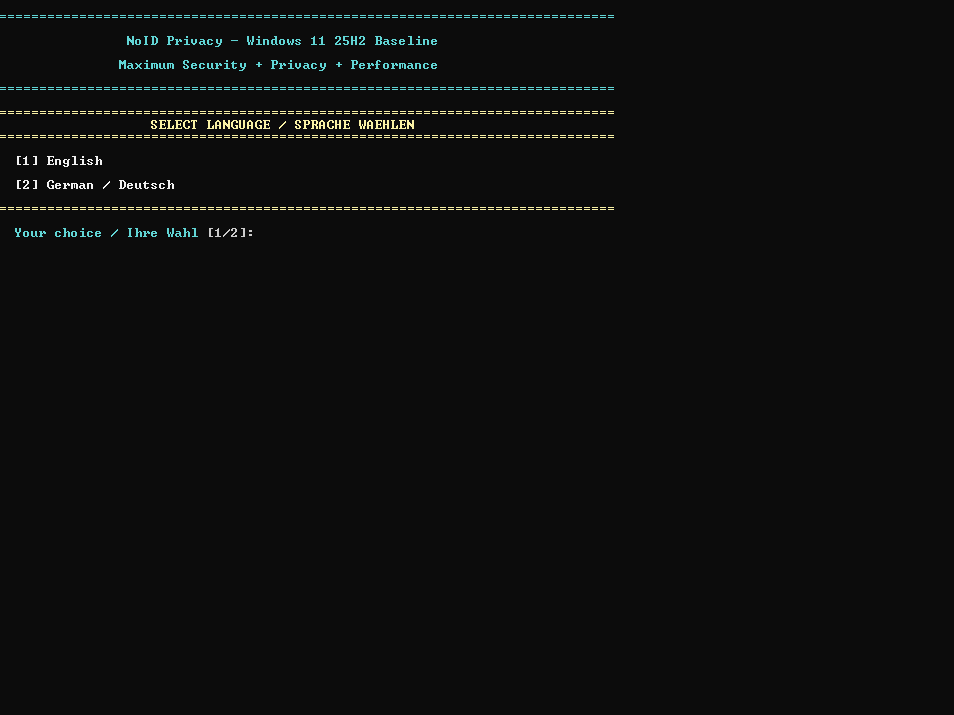
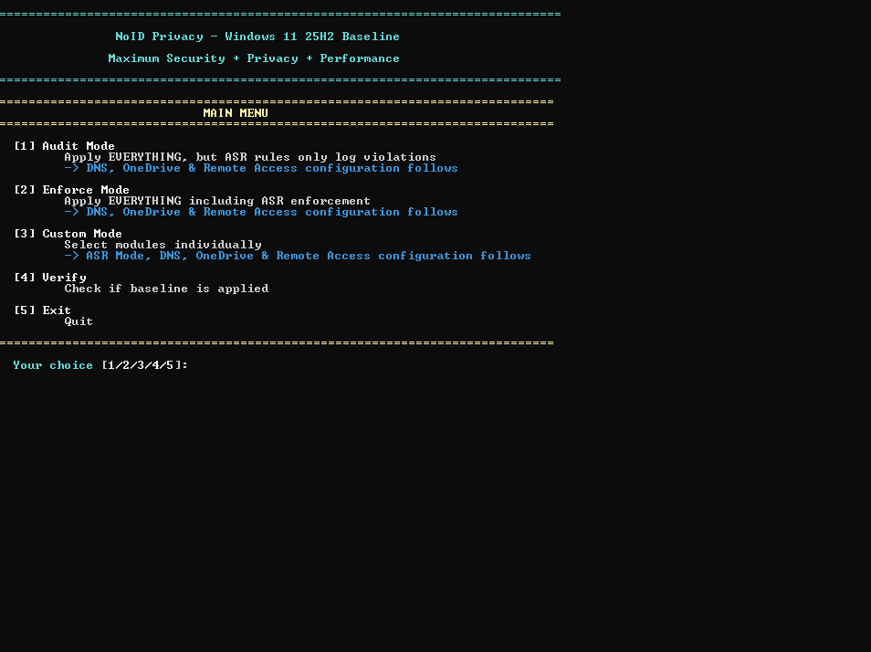
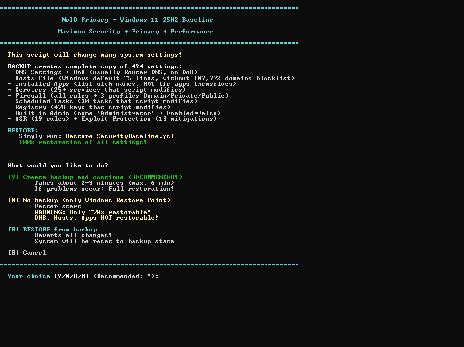
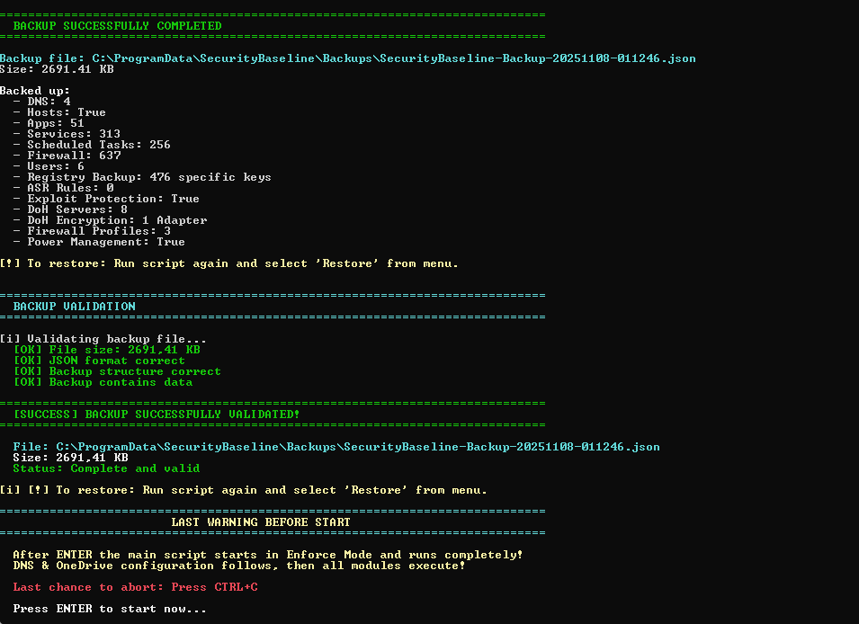
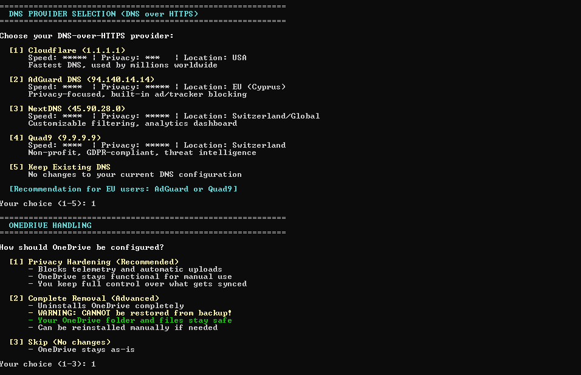
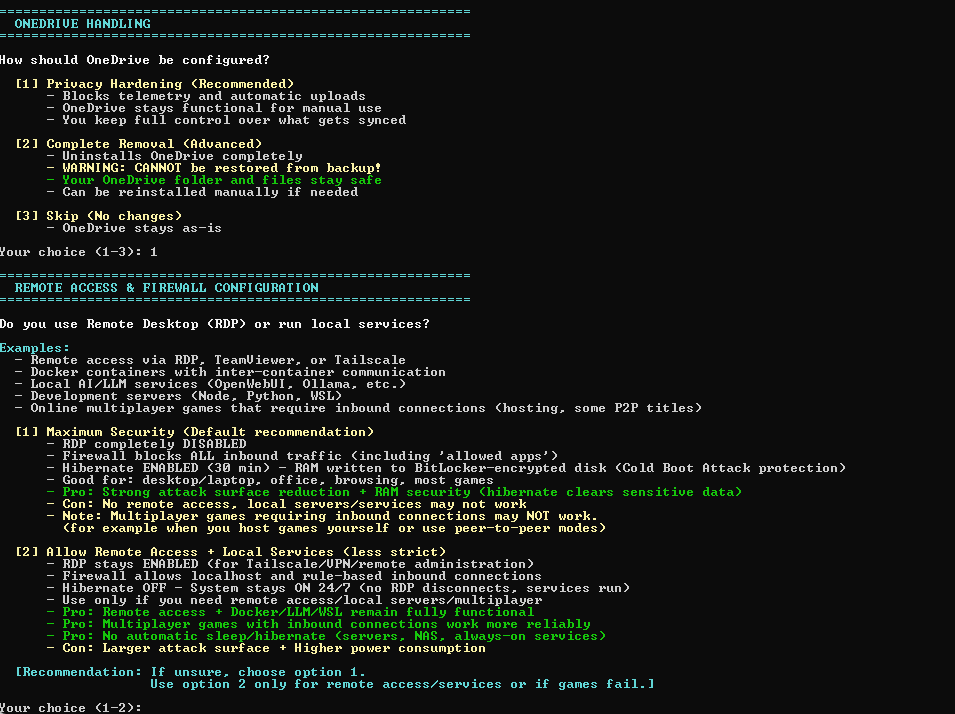
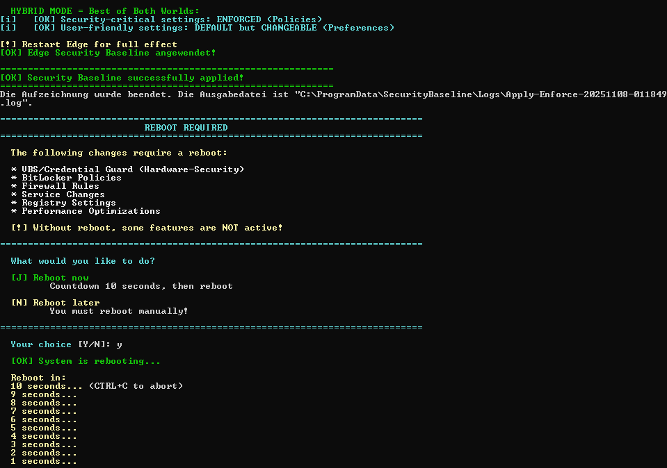

# 📸 NoID Privacy – Screenshot Gallery

Complete visual walkthrough of the installation and configuration process.

---

## 1️⃣ Language Selection



**Runtime language switch between English and German** – no separate download needed, no restart required. Simply choose your preferred language and all menus, prompts, and UI text adapt instantly.

---

## 2️⃣ Main Menu



**Choose your security mode:**
- **[1] Audit Mode:** Apply everything, but ASR rules only log violations (test environment)
  - → DNS, OneDrive & Remote Access configuration follows
- **[2] Enforce Mode:** Apply everything including ASR enforcement (production)
  - → DNS, OneDrive & Remote Access configuration follows
- **[3] Custom Mode:** Select modules individually
  - → ASR Mode, DNS, OneDrive & Remote Access configuration follows
- **[4] Verify:** Check if baseline is applied (133 verification checks)
- **[5] Exit:** Quit

---

## 3️⃣ Backup Decision



**Complete system state backup before any changes:**
- **[Y] Create backup and continue (RECOMMENDED)** – Takes about 2-6 minutes (max. 6 min)
  - If problems occur, full restoration possible!
- **[N] No backup (only Windows Restore Point)** – Faster start
  - ⚠️ WARNING: Only ~70% restorable!
  - DNS, Hosts, Apps NOT restorable!
- **[R] RESTORE from backup** – Reverts all changes, system will be reset to backup state
- **[0] Cancel** – Exit without changes

---

## 4️⃣ Backup Success



**Backup successfully completed!**

Backed up:
- **DNS:** 4 adapters
- **Hosts:** True (107,722 domains blocklist)
- **Apps:** True (list with names, NOT the apps themselves)
- **Services:** 313 services
- **Scheduled Tasks:** 256 tasks
- **Firewall:** 637 rules
- **Users:** 6 accounts
- **Registry Backup:** 476 specific keys
- **ASR Rules:** All 19 rules
- **DoH Configuration:** True
- **DoH Servers:** 8 DNS servers
- **DoH Encryption:** 1 adapter
- **Firewall Profiles:** 3 profiles (Domain/Private/Public)
- **Power Management:** True

**File:** `C:\ProgramData\SecurityBaseline\Backups\SecurityBaseline-Backup-20251108-011246.json`  
**Size:** 2691.41 KB

---

## 5️⃣ DNS Provider Selection



**Choose your DNS-over-HTTPS provider:**

| Provider | Best For | Features |
|----------|----------|----------|
| **[1] Cloudflare** (1.1.1.1) | Speed + Global Coverage | Fastest DNS, used by millions worldwide |
| **[2] AdGuard DNS** (94.140.14.14) | Privacy + EU Compliance | Privacy-focused, built-in ad/tracker blocking (Cyprus) |
| **[3] NextDNS** (45.90.28.0) | Customization + Analytics | Customizable filtering, analytics dashboard (Switzerland/Global) |
| **[4] Quad9** (9.9.9.9) | Security + Threat Intelligence | Non-profit, GDPR-compliant, threat intelligence (Switzerland) |
| **[5] Keep Existing DNS** | No Changes | No changes to your current DNS configuration |

**Recommendation for EU users:** AdGuard or Quad9

---

## 6️⃣ OneDrive Configuration


*(Upper section shows OneDrive handling options)*

**How should OneDrive be configured?**

- **[1] Privacy Hardening (Recommended)**
  - Blocks telemetry and automatic uploads
  - OneDrive stays functional for manual use
  - You keep full control over what gets synced
  
- **[2] Complete Removal (Advanced)**
  - Uninstalls OneDrive completely
  - ⚠️ WARNING: CANNOT be restored from backup!
  - Your OneDrive folder will stay safe
  - Can be reinstalled manually if needed

- **[3] Skip (No changes)**
  - OneDrive stays as-is

---

## 7️⃣ Remote Access & Firewall Configuration


**Do you use Remote Desktop (RDP) or run local services?**

Examples:
- Remote access via RDP, TeamViewer, or Tailscale
- Docker containers with inter-container communication
- Local AI/LLM services (OpenWebUI, Ollama, etc.)
- Development servers (Node, Python, WSL)
- Online multiplayer games that require inbound connections (hosting, some P2P titles)

**[1] Maximum Security (Default recommendation)**
- RDP completely DISABLED
- Firewall blocks ALL inbound traffic (including 'allowed apps')
- Hibernate ENABLED (30 min) → RAM written to BitLocker-encrypted disk (Cold Boot Attack protection)
- **Good for:** desktop/laptop, office, browsing, most games
- ⚠️ **Hibernate clears sensitive data** (legitimate security feature)
- **Con:** No remote access, local servers/services may not work
- **Note:** Multiplayer games requiring inbound connections may NOT work (check game-specific docs)

**[2] Allow Remote Access + Local Services (Less strict)**
- RDP stays ENABLED (for Tailscale/VPN/remote administration)
- Firewall allows localhost and rule-based inbound connections
- Hibernate OFF → System stays ON 24/7 (no RDP disconnects, services run)
- **Use only if you need:** remote access/local servers/multiplayer
- **Pro:** Multiplayer games with inbound connections work more reliably
- **Pro:** No automatic sleep/hibernate (NAS, servers on services)
- **Con:** Larger attack surface + Higher power consumption

**[Recommendation: If unsure, choose option 1.]**  
Use option 2 only for remote access/services or if games fail.

---

## 8️⃣ Security Baseline Applied Successfully



**[OK] Security Baseline successfully applied!**

**HYBRID MODE = Best of Both Worlds:**
- **[i] [OK] Security-critical settings: ENFORCED (Policies)** → Cannot be changed via Settings app
- **[i] [OK] User-friendly settings: DEFAULT but CHANGEABLE (Preferences)** → Can be adjusted in Settings if needed

**[!] Restart Edge for full effect**  
**[OK] Edge Security Baseline angewendet!**

---

**REBOOT REQUIRED**

The following changes require a reboot:
- ★ VBS/Credential Guard (Hardware-Security)
- ★ BitLocker Policies
- ★ Firewall Rules
- ★ Service Changes
- ★ Registry Settings
- ★ Power Optimizations

**[!] Without reboot, some features are NOT active!**

---

## 📊 What Gets Applied?

### Security (🛡️)
- **Microsoft Defender:** 11 protection layers
- **19 ASR Rules:** Ransomware, macro, exploit blocking
- **13 Exploit Mitigations:** Memory-based attack prevention
- **Credential Guard + VBS:** Password theft protection
- **BitLocker XTS-AES-256:** Full disk encryption
- **Strict Firewall:** All inbound blocked + 13 legacy protocol blocks

### Privacy (🔒)
- **Telemetry Minimized:** 25+ services + 30 tasks + 478 registry keys
- **AI Lockdown:** 9 features (Recall, Copilot, Click to Do, etc.)
- **App Permissions:** 37 categories default-DENY
- **Bloatware Removed:** 80+ app patterns
- **107,772 Trackers Blocked:** DNS-level via Steven Black hosts

### Performance (⚡)
- **30 Background Tasks Disabled:** Less CPU/disk usage
- **Event Log Optimization:** Critical logs increased, noise reduced
- **No Bloatware:** Faster boot, more disk space

---

## 🔄 Restore Process

If you created a backup, you can restore everything at any time:

```powershell
.\Restore-SecurityBaseline.ps1
```

**Restores:**
- ✅ All 476+ registry keys
- ✅ All 313 services
- ✅ All 256 scheduled tasks
- ✅ All 637 firewall rules
- ✅ DNS settings (4 adapters)
- ✅ DoH configuration
- ✅ Power management
- ✅ ASR rules
- ⚠️ Removed apps must be reinstalled from Microsoft Store

---

## 🎯 Verification

After reboot, verify everything is working:

```powershell
.\Verify-SecurityBaseline.ps1
```

**133 verification checks:**
- ✅ Windows Defender (11 checks)
- ✅ ASR Rules (19 checks)
- ✅ Exploit Protection (13 checks)
- ✅ VBS/Credential Guard (2 checks)
- ✅ BitLocker (1 check)
- ✅ Firewall (15 checks)
- ✅ Services (25 checks)
- ✅ Registry (47 checks)

---

## 🚀 Quick Links

- **[📖 README](README.md)** – Main documentation
- **[🎯 Quick Start](QUICKSTART.md)** – Detailed installation guide
- **[❓ FAQ](FAQ.md)** – Frequently asked questions
- **[🐛 Known Issues](KNOWN_ISSUES.md)** – Compatibility notes
- **[🔧 Features](FEATURES.md)** – Complete feature list

---

<div align="center">

**Made with ❤️ for the Windows Security Community**

[Report Bug](https://github.com/NexusOne23/noid-privacy/issues) · [Request Feature](https://github.com/NexusOne23/noid-privacy/issues)

</div>
